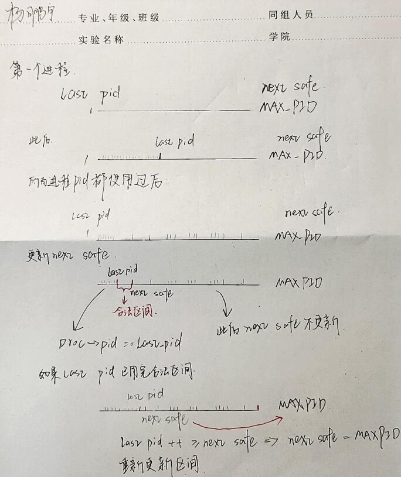

# Lab4实验报告

## 实验目的

- 了解内核线程创建/执行的管理过程
- 了解内核线程的切换和基本调度过程

## 实验内容

### 练习一：分配并初始化一个进程控制块

#### 1.内核线程及管理

​		内核线程是一种特殊的进程，内核线程与用户进程的区别有两个：内核线程只运行在内核态，用户进程会在在用户态和内核态交替运行；所有内核线程直接使用共同的ucore内核内存空间，不需为每个内核线程维护单独的内存空间，而用户进程需要拥有各自的内存空间。

​		把内核线程看作轻量级的进程，对内核线程的管理和对进程的管理是一样的。对进程的管理是通过进程控制块结构实现的，将所有的进程控制块通过链表链接在一起，形成进程控制块链表，对进程的管理和调度就通过从链表中查找对应的进程控制块来完成。

#### 2.进程控制块

​		保存进程信息的进程控制块结构的定义在kern/process/proc.h中定义如下：

```c
struct proc_struct {
    enum proc_state state; 		// Process state
    int pid; 					// Process ID
    int runs; 					// the running times of Proces
    uintptr_t kstack; 			// Process kernel stack
    volatile bool need_resched; // need to be rescheduled to release CPU?
    struct proc_struct *parent; // the parent process
    struct mm_struct *mm; 		// Process's memory management field
    struct context context; 	// Switch here to run process
    struct trapframe *tf; 		// Trap frame for current interrupt
    uintptr_t cr3; 				// the base addr of Page Directroy Table(PDT)
    uint32_t flags; 			// Process flag
    char name[PROC_NAME_LEN + 1]; // Process name
    list_entry_t list_link; 	// Process link list
    list_entry_t hash_link; 	// Process hash list
};
```

- mm：在Lab3中，该结构用于内存管理。在对内核线程管理时，由于内核线程不需要考虑换入换出，该结构不需要使用，因此设置为NULL。唯一需要使用的是mm中的页目录地址，保存在cr3变量中。
- state：进程状态，有以下几种
  - PROC_UNINIT：未初始化    
  - PROC_SLEEPING：睡眠状态            
  - PROC_RUNNABLE：可运行（可能正在运行）
  - PROC_ZOMBIE：等待回收
- parent：父进程
- context：进程上下文，用于进程切换
- tf：中断帧指针，用于中断后恢复进程状态
- cr3：页目录的物理地址，用于进程切换时快速找到页表位置
- kstack：线程所使用的内核栈
- list_link：所有进程控制块链接形成的链表的节点
- hash_link：所有进程控制块有一个根据pid建立的哈希表，hash_link是该链表的节点

​		为了管理系统中的所有进程控制块，ucore还维护了以下全局变量：

-  static struct proc  *current：当前占用CPU且处于“运行”状态进程控制块指针。通常这个变量是只读的，只有在进程切换的时候才进行修改，并且整个切换和修改过程需要保证操作的原子性，需要屏蔽中断。
-  static struct proc *initproc：本实验中，指向一个内核线程。本实验以后，此指针将指向第一个用户态进程。
-  static list_entry_t hash_list[HASH_LIST_SIZE]：所有进程控制块的哈希表，proc_struct中的成员变量hash_link将基于pid链接入这个哈希表中。
-  list_entry_t proc_list：所有进程控制块的双向线性列表，proc_struct中的成员变量list_link将链接入这个链表中。

#### 3.分配并初始化一个进程控制块

​		内核线程创建之前，需要先创建一个进程控制块管理保存进程信息。alloc_proc函数负责分配创建一个proc_struct结构，并进行基本的初始化。此时仅是创建了进程块，内核线程本身还没有创建。这是练习一需要完成的部分，具体的实现如下：

```c
static struct proc_struct *
alloc_proc(void) {
    struct proc_struct *proc = kmalloc(sizeof(struct proc_struct));
    if (proc != NULL) {
     	proc->state=PROC_UNINIT;					//初始状态
     	proc->pid=-1;								//初始PID设为-1
     	proc->runs=0;								
     	proc->kstack=0;								
     	proc->need_resched=0;						
     	proc->parent=NULL;
     	proc->mm=NULL;
        memset(&(proc -> context), 0, sizeof(struct context)); 
     	proc->tf=NULL;
     	proc->cr3=boot_cr3;							//内核线程在内核运行，使用内核页目录
     	proc->flags=0;
     	memset(proc->name,0,PROC_NAME_LEN);
    }
    return proc;
}
```

#### 4.问题一

​		请说明proc_struct中struct context context和struct trapframe *tf成员变量含义和在本实验中的作用为？

​		context保存了进程的上下文信息，即各个寄存器的值，用于进程切换时恢复上下文。tf是中断帧的指针，指向中断帧。中断帧记录了进程被中断前的信息，除寄存器外还有中断号，错误码等信息，用于中断处理后进程状态的恢复。发生中断时，首先从TSS中找到进程内核栈的指针切换到内核栈，然后在内核栈顶建立trapframe，进入内核态。当中断服务例程运行结束，从中断返回时，再从trapframe恢复寄存器的值，并切换回用户态。用户程序在用户态通过系统调用进入内核态，以及在内核态新创建的进程，都通过tf指向的中断帧恢复寄存器的值，从而回到用户态继续运行。

### 练习二：为新创建的内核线程分配资源

#### 1.进程资源的分配

​		练习一中实现的alloc_proc为进程创建了进程控制块，将新的进程创建还需要为其分配资源。具体为分配内核栈，将当前的进程的代码及数据，上下文等信息复制给新进程。分配资源的工作是由**do_fork**函数完成的。do_fork函数会完成分配资源，将新进程添加到进程列表，并把进程设置为可运行状态，最后返回新进程号。

​		使用do_fork完成资源分配需要使用一些其他函数，这些函数都定义在pro.c中。首先是练习一中实现的创建进程控制块的alloc_proc函数，接下来分配资源的同时也会设置进程控制块中的信息。分配内核栈使用的是setup_kstack函数，通过调用alloc_pages分配大小为KPAGESIZE的页用于栈空间。复制内存管理信息使用的是copy_mm函数，由于本实验创建的是内核线程，常驻内存，不需要进行这个工作。最后是copy_thread函数，完成对原进程的上下文和中断帧的复制。

​		其中中断帧和上下文的一些内容需要单独进行设置，子进程将在上下文切换后完成进程切换，准备运行，因此上下文的eip设置为forkret，上下文的esp设置为中断帧tf位置，在forkret将从中断帧恢复进程状态，运行进程。中断帧的eax设置为0，因为子进程会返回0，esp设置为父进程的用户栈指针，本实验中创建内核线程，创建出的线程将与父线程共享数据。对于用户进程，copy_mm将复制父进程的内存空间，建立新的页表及映射，使子进程有自己的内存空间。

```c
//分配内核栈空间
static int setup_kstack(struct proc_struct *proc) {
    struct Page *page = alloc_pages(KSTACKPAGE);
    if (page != NULL) {
        proc->kstack = (uintptr_t)page2kva(page);
        return 0;
    }
    return -E_NO_MEM;
}
//copy_mm，根据clone_flags判断复制还是共享内存管理信息
static int copy_mm(uint32_t clone_flags, struct proc_struct *proc) {
    assert(current->mm == NULL);
    /* do nothing in this project */
    return 0;
}
//复制原进程的上下文
static void
copy_thread(struct proc_struct *proc, uintptr_t esp, struct trapframe *tf) {
    proc->tf = (struct trapframe *)(proc->kstack + KSTACKSIZE) - 1;	//内核栈顶
    *(proc->tf) = *tf;
    proc->tf->tf_regs.reg_eax = 0;					//子进程返回0
    proc->tf->tf_esp = esp;							//父进程的用户栈指针
    proc->tf->tf_eflags |= FL_IF;					//设置能够响应中断
    proc->context.eip = (uintptr_t)forkret;			//返回
    proc->context.esp = (uintptr_t)(proc->tf);		//trapframe
}
```

​		通过以上三个函数，就可以为新进程分配资源，并复制原进程的状态。接下来就可以给这个进程设置一个pid，放入进程列表了。设置pid使用get_pid函数，这个函数在下面的问题一中进行分析。将进程加入进程的哈希列表使用hash_proc函数，还需要使用wakeup_proc函数将进程设置为可运行状态，最后返回该进程的pid，do_fork函数就完成了进程的资源分配。

```c
//将proc加入到hash_list
static void hash_proc(struct proc_struct *proc) {
    list_add(hash_list + pid_hashfn(proc->pid), &(proc->hash_link));
}
//sched.c中的wakeup_proc
void wakeup_proc(struct proc_struct *proc) {
    assert(proc->state != PROC_ZOMBIE && proc->state != PROC_RUNNABLE);
    proc->state = PROC_RUNNABLE;
}
```

​		在获取pid和将进程加入链表的操作中，需要使用进程链表，而进程链表是一个全局变量，为了保证多进程下对共享数据的使用不会产生错误，需要添加互斥。此处可能产生的错误在下面问题一中具体分析，此处先说明互斥是如何实现的。对共享数据的使用会产生错误，是因为调度的不可控，可能产生多个线程同时访问临界区的情况。因此只要避免在临界区代码处发生调度就可以实现互斥。在ucore中，提供了local_intr_save和local_intr_restore函数屏蔽和使能中断。这两个函数在kern\sync中，通过一系列调用，最终使用cli和sti进行中断的屏蔽和使能。

```c
static inline bool
__intr_save(void) {
    if (read_eflags() & FL_IF) {
        intr_disable();
        return 1;
    }
    return 0;
}

static inline void
__intr_restore(bool flag) {
    if (flag) {
        intr_enable();
    }
}
#define local_intr_save(x)      do { x = __intr_save(); } while (0)
#define local_intr_restore(x)   __intr_restore(x);
//使用方式如下：
bool intr_flag;
local_intr_save(intr_flag);
//临界区代码
local_intr_restore(intr_flag);
```

#### 2.do_fork分配资源的实现

​		使用以上提到的相关函数，就可以实现do_fork，为新创建的内核线程分配资源。需要注意的是如果分配资源的某一步不成功，需要把之前分配的资源回收。最终do_fork的实现如下，clone_flags为是否与父进程共享内存管理信息的标志，stack为父进程的用户栈，tf为父进程的中断栈。这是练习二需要完成的部分，代码如下：

```c
int
do_fork(uint32_t clone_flags, uintptr_t stack, struct trapframe *tf) {
    int ret = -E_NO_FREE_PROC;
    struct proc_struct *proc;
    if (nr_process >= MAX_PROCESS) {
        goto fork_out;
    }
    ret = -E_NO_MEM;
    //资源分配
    if((proc=alloc_proc())==NULL) {
    	goto fork_out;
    }
    proc->parent = current;			//父进程为当前进程（current为全局变量）
    if(setup_kstack(proc)) {
    	goto bad_fork_cleanup_proc;
    }
    if(copy_mm(clone_flags,proc)) {
    	goto bad_fork_cleanup_kstack;
    }
    copy_thread(proc, stack, tf);	//复制上下文和中断帧
   	//设置pid，加入进程列表，设置为可运行
    bool intr_flag;
    local_intr_save(intr_flag);		//关中断
    ｛
        proc->pid = get_pid();
    	hash_proc(proc);
    	list_add(&proc_list, &(proc->list_link));
    	nr_process ++;
    ｝
    local_intr_restore(intr_flag);
    wakeup_proc(proc);
    ret=proc->pid;
    
fork_out:
    return ret;

bad_fork_cleanup_kstack:
    put_kstack(proc);
bad_fork_cleanup_proc:
    kfree(proc);
    goto fork_out;
}
```

​		make qemu运行后，可以看到init_main内核线程运行，该线程只输出字符串，在后续实验用于创建其他内核线程或用户进程。

```shell
...
this initproc, pid = 1, name = "init"
To U: "Hello world!!".
To U: "en.., Bye, Bye. :)"
kernel panic at kern/process/proc.c:347:
    process exit!!.
...
```

#### 3.问题一

​		请说明ucore是否做到给每个新fork的线程一个唯一的id？请说明你的分析和理由。

​		ucore通过调用get_pid函数分配pid，对get_pid函数进行分析。

​		分配pid前，get_pid会先确认可用进程号大于最大进程数。该函数定义了两个静态全局变量，next_safe最初被设置为最大进程号，last_pid最初设置为1，[last_pid，next_safe]就是合法的pid区间。如果last_pid++在这个区间内，就可以直接返回last_pid作为新分配的进程号。如果last_pid>=next_safe，就将next_safe设置为MAX_PID，遍历链表确保last_pid和已有进程的pid不相同，并更新next_safe。维护last_pid到next_safe这个区间将可用的pid范围缩小，以提高了分配的效率，如果区间不合法，也会重新更新区间，并排除和已有进程进程号相同的情况，因此最终产生的进程的pid是唯一的。但是需要注意的是进程链表是全局变量，如果有另一个进程get_pid后还没有把进程加入链表，调度到了当前进程，而当前进程又需要遍历链表排除进程号相同的情况，就可能产生错误，因此要在get_pid和将进程加入链表的位置添加互斥。保证互斥的方法为在do_fork中分配进程号和进程加入进程链表的部分关中断，避免进程调度。



```c
static int
get_pid(void) {
    static_assert(MAX_PID > MAX_PROCESS);
    struct proc_struct *proc;
    list_entry_t *list = &proc_list, *le;
    static int next_safe = MAX_PID, last_pid = MAX_PID;
    if (++ last_pid >= MAX_PID) {
        last_pid = 1;
        goto inside;
    }
    //区间合法性判断
    if (last_pid >= next_safe) {
    inside:
        next_safe = MAX_PID;
    repeat:
        le = list;
        //遍历进程链表
        while ((le = list_next(le)) != list) {
            proc = le2proc(le, list_link);
            if (proc->pid == last_pid) {
                if (++ last_pid >= next_safe) {
                    if (last_pid >= MAX_PID) {
                        last_pid = 1;
                    }
                    next_safe = MAX_PID;
                    goto repeat;			//区间不合法，重新遍历链表
                }
            }
            else if (proc->pid > last_pid && next_safe > proc->pid) {
                next_safe = proc->pid;		//更新next_safe	
            }
        }
    }
    return last_pid;
}
```

### 练习三：proc_run 函数及进程切换

#### 1.proc_run

​		proc_run函数用于进程切换时，运行要切换到的进程。当发生进程调度时，调度程序schedule会在进程链表中寻找一个就绪（state == PROC_RUNNABLE）的进程，并向proc_run传入进程控制块，切换运行这个进程。proc_run完成的工作为将当前进程设置为要运行的新进程，设置任务状态段tss中特权态0下的栈顶指针esp0为要运行的进程内核栈的栈顶，切换到要运行进程的页表，最后进行上下文切换。

```c
void proc_run(struct proc_struct *proc) {
    if (proc != current) {
        bool intr_flag;
        struct proc_struct *prev = current, *next = proc;
        local_intr_save(intr_flag);
        {
            current = proc;									//当前进程设置为要运行的进程
            load_esp0(next->kstack + KSTACKSIZE);			//设置TSS中特权级0的栈顶指针
            lcr3(next->cr3);								//切换页表
            switch_to(&(prev->context), &(next->context));	//上下文切换
        }
        local_intr_restore(intr_flag);
    }
}
```

​		设置任务状态段tss中特权态0下的栈顶指针esp0是为了在未来进程运行时的特权级切换做好准备。在发生中断时，需要切换到内核栈，并保存当前的运行状态。esp0就是进程的内核栈的栈顶指针，通过这个指针就可以找到进程的内核栈，并从这里开始压栈保存当前的状态（trapframe），每个进程都有自己的内核栈，因此这个值需要随进程切换而重新设置。

```c
//pmm.c中定义的load_esp0
void load_esp0(uintptr_t esp0) {
    ts.ts_esp0 = esp0;
}
```

​		切换页表需要使用lcr3函数重新加载cr3寄存器。在本实验中，内核线程都使用内核的地址空间，页目录都是boot_cr3，这一步在本实验没有作用。

```c
//x86.h中定义的lcr3
static inline void lcr3(uintptr_t cr3) {
    asm volatile ("mov %0, %%cr3" :: "r" (cr3) : "memory");
}
```

​		上下文切换是调用Switch.S中定义的switch_to函数完成的。函数调用时，调用者的esp+4，esp+8会依次存放传入的参数。此处开始的esp+4就是原进程的context结构，call指令调用函数时，会将返回地址压栈，因此esp处的值为返回地址，首先将这个值出栈保存，接下来就是将context包括的寄存器保存到相应的位置。esp+8的位置是新进程的context，但是由于之前使用了pop指令，因此此时esp+4就是切换到的进程的context，将切换到的进程的上下文恢复，最后的push指令会将返回地址入栈，最后的ret指令就会返回到要切换到的进程，运行要切换到的进程，这样就完成了进程的切换。

```c
switch_to:                      # switch_to(from, to)

    # save from's registers
    movl 4(%esp), %eax          # eax points to from
    popl 0(%eax)                # save eip !popl
    movl %esp, 4(%eax)          # save esp::context of from
    movl %ebx, 8(%eax)          # save ebx::context of from
    movl %ecx, 12(%eax)         # save ecx::context of from
    movl %edx, 16(%eax)         # save edx::context of from
    movl %esi, 20(%eax)         # save esi::context of from
    movl %edi, 24(%eax)         # save edi::context of from
    movl %ebp, 28(%eax)         # save ebp::context of from

    # restore to's registers
    movl 4(%esp), %eax          # not 8(%esp): popped return address already
                                # eax now points to to
    movl 28(%eax), %ebp         # restore ebp::context of to
    movl 24(%eax), %edi         # restore edi::context of to
    movl 20(%eax), %esi         # restore esi::context of to
    movl 16(%eax), %edx         # restore edx::context of to
    movl 12(%eax), %ecx         # restore ecx::context of to
    movl 8(%eax), %ebx          # restore ebx::context of to
    movl 4(%eax), %esp          # restore esp::context of to

    pushl 0(%eax)               # push eip

    ret
```

​		综上，一个新内核线程建立后切换运行经历了以下步骤：

​		中断发生，向内核栈顶压入当前寄存器值，建立trapframe

​		---->schedule()选择需要切换到的线程

​		---->proc_run()设置新进程的内核栈顶(为下次中断做准备)

​		---->switch_to()上下文切换

​		---->forkret()->forkrets()->__trapret从trapframe恢复寄存器（do_fork中设置上下文切换后执行forkret）

​		---->kernel_thread_entry中执行call指令，执行内核线程代码

#### 2.问题一

​		在本实验的执行过程中，创建且运行了几个内核线程？

​		在本实验中，共创建并运行了两个内核线程。一个是idleproc，另一个是initproc。

​		**idleproc**

​		idlepro是0号内核线程。kern_init调用了proc_init，在proc_init中会创建该线程。该线程的need_resched设置为1，运行cpu_idle函数，总是要求调度器切换到其他线程。

```c
//proc_init中创建idle_proc
	if ((idleproc = alloc_proc()) == NULL) {
        panic("cannot alloc idleproc.\n");
    }
	//线程初始化
    idleproc->pid = 0;								//0号线程
    idleproc->state = PROC_RUNNABLE;				//设置为可运行
    idleproc->kstack = (uintptr_t)bootstack;		//启动后的内核栈被设置为该线程的内核栈
    idleproc->need_resched = 1;						
    set_proc_name(idleproc, "idle");
    nr_process ++;
    current = idleproc;
//kern_init最后会运行该内核线程，调度到其他线程
void cpu_idle(void) {
    while (1) {
        if (current->need_resched) {
            schedule();
        }
    }
}
```

​		**initproc**

​		initproc是第1号线程，未来所有的进程都是由该线程fork产生的。init_proc也是在proc_init中创建的，通过调用kernel_thread创建，该线程运行init_main并输出字符串。

```c
//init_proc的创建
    int pid = kernel_thread(init_main, "Hello world!!", 0);
    if (pid <= 0) {
        panic("create init_main failed.\n");
    }
    initproc = find_proc(pid);
    set_proc_name(initproc, "init");
```

​		kernel_thread中定义了一个trapframe结构，然后将该结构传入do_fork完成线程的建立。

```c
int kernel_thread(int (*fn)(void *), void *arg, uint32_t clone_flags) {
    struct trapframe tf;
    memset(&tf, 0, sizeof(struct trapframe));
    tf.tf_cs = KERNEL_CS;
    tf.tf_ds = tf.tf_es = tf.tf_ss = KERNEL_DS;			//使用内核的代码和数据段
    tf.tf_regs.reg_ebx = (uint32_t)fn;					//函数地址
    tf.tf_regs.reg_edx = (uint32_t)arg;					//参数
    tf.tf_eip = (uint32_t)kernel_thread_entry;			//kernel_thread_entry中将进入ebx指定的函数执行
    return do_fork(clone_flags | CLONE_VM, 0, &tf);
}
```

​		该线程创建完成后，proc_init也完成了工作，返回到kern_init，kern_init会运行idle_proc的cpu_idle，进行进程调度，从而切换运行init_proc。切换线程是调度器schedule函数完成的，该函数会在进程链表中寻找一个就绪的进程，调用proc_run切换到改进程。proc_run会进行上下文切换，而在do_fork中调用的copy_thread函数中，将context.eip设置为了forkret，进程切换完成后从forkret开始运行。forkret实际上是forkrets，forkrets会从当前进程的trapframe恢复上下文，然后跳转到设置好的kernel_thread_entry。

```c
.globl forkrets
forkrets:
    # set stack to this new process's trapframe
    movl 4(%esp), %esp
    jmp __trapret
        
.globl __trapret
__trapret:
    # restore registers from stack
    popal

    # restore %ds, %es, %fs and %gs
    popl %gs
    popl %fs
    popl %es
    popl %ds

    # get rid of the trap number and error code
    addl $0x8, %esp
    iret										//tf.tf_eip = (uint32_t)kernel_thread_entry;
```

​		kernel_thread_entry会压入edx保存的参数，调用ebx指向的函数，保存返回值，然后do_exit回收资源。通过kernel_thread_entry，内核线程可以执行对应的函数，并在执行结束后自动调用do_exit终止线程并回收资源。

```c
.globl kernel_thread_entry
kernel_thread_entry:        # void kernel_thread(void)
    pushl %edx              # push arg
    call *%ebx              # call fn
    pushl %eax              # save the return value of fn(arg)
    call do_exit            # call do_exit to terminate current thread
```

#### 3.问题二

​		语句local_intr_save(intr_flag);....local_intr_restore(intr_flag);在这里有何作用？请说明理由。

​		在练习二的do_fork实现中，已经使用了这两个语句。这两个函数的作用是屏蔽和使能中断，他们的定义在kern\sync中，通过一系列调用，最终使用cli和sti进行中断的屏蔽和使能。在临界区使用这两个函数暂时屏蔽中断，避免进程调度，从而提供互斥。在proc_run中完成了上下文切换等重要工作，如果没有互斥，当前进程被设置为要切换运行的进程，但还没有完成上下文的切换，如果在此时发生了进程调度，就可能产生错误。

## 实验总结

### 与参考答案的对比

**练习一**

​		与参考答案一致，完成进程控制块的初始化，进行最基本的设置。

**练习二**

​		缺少proc->parent = current，没有设置创建的进程的父进程为当前进程，根据参考答案补全。

**练习三**

​		根据实验指导书，对相关代码进行分析。总结进程切换的过程，2个内核线程的创建过程。

### 重要知识点

- 内核线程和用户进程的区别
- 进程控制块
- 内核线程的创建
- 内核线程资源分配
- 进程(线程)切换的过程

​		本实验主要是内核线程创建与切换的具体实现。在ucore中，首先创建idle_proc这个第0号内核线程，然后调用kernel_thread建立init_proc第1号内核线程，最后回到kern_init执行idle_proc线程，idle_proc总是调度到其他线程。线程具体的创建是由do_fork完成的，do_fork调用alloc_proc等函数，完成进程控制块的创建，内核栈和pid的分配，父进程上下文和中断帧的复制，还会进行一些设置，如将上下文的eip设置为fork_ret，在trapframe中将返回值设置为0等。创建完毕后返回pid，当调度器调度该线程时，调度器调用proc_run完成上下文切换后就会执行fork_ret，恢复中断帧，从而开始执行指定的程序。

### 未涉及的内容

- 用户进程创建
- 进程调度策略
- 文件系统

​		
