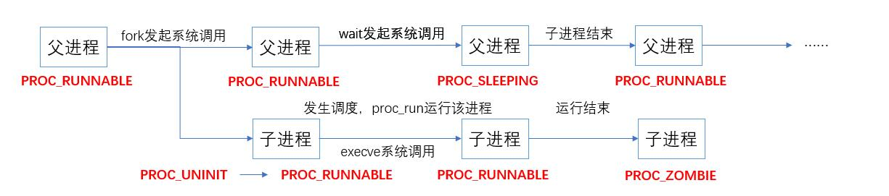

# Lab5实验报告

## 实验目的

- 了解第一个用户进程创建过程
- 了解系统调用框架的实现机制
- 了解ucore如何实现系统调用sys_fork/sys_exec/sys_exit/sys_wait来进行进程管理

## 实验内容

### 练习0:已有实验代码改进

​		本实验中完成了用户进程的创建，能够对用户进程进行基本管理，并为用户进程提供了必要的系统调用。为了支持用户进程，需要对已完成的实验代码进行改进。

#### 1.proc_struct结构

​		为了能够管理进程，进程控制块中新增加了变量，记录等待状态和退出原因，并将相关进程通过链表链接起来。

- exit_code：记录进程的退出原因，这个值将传给等待的父进程
- wait_state：标记当前进程是否处于等待状态
- cptr：当前进程的子进程双向链表结点
- yptr/optr：当前进程的older sibling和younger sibling的双向链表结点

```c
struct proc_struct {
    enum proc_state state;                      // Process state
    int pid;                                    // Process ID
    int runs;                                   // the running times of Proces
    uintptr_t kstack;                           // Process kernel stack
    volatile bool need_resched;                 // bool value: need to be rescheduled to release CPU?
    struct proc_struct *parent;                 // the parent process
    struct mm_struct *mm;                       // Process's memory management field
    struct context context;                     // Switch here to run process
    struct trapframe *tf;                       // Trap frame for current interrupt
    uintptr_t cr3;                              // CR3 register: the base addr of Page Directroy Table(PDT)
    uint32_t flags;                             // Process flag
    char name[PROC_NAME_LEN + 1];               // Process name
    list_entry_t list_link;                     // Process link list 
    list_entry_t hash_link;                     // Process hash list
    int exit_code;                              // exit code (be sent to parent proc)
    uint32_t wait_state;                        // waiting state
    struct proc_struct *cptr, *yptr, *optr;     // relations between processes
};
```

#### 2.alloc_proc

​		由于进程控制块增加了新的变量，分配进程控制块时也需要进行相应的初始化。只需要在alloc_proc添加，将等待状态设为0，链表节点设为NULL。

```c
    ... 
	proc->wait_state=0;
    proc->cptr = proc->optr = proc->yptr = NULL;
	...
```

#### 3.do_fork

​		do_fork中进行了进程的复制，对新的进程控制块的设置也需要补充。确认等待状态为0，只有在wait状态时进程的wait_state才会被设置为等待，一旦被唤醒，在wakeup_proc就会重新设置为0，此时应该不在等待状态。调用set_links将新进程和相关进程建立联系。补充后的do_fork如下：

```c
    if((proc=alloc_proc())==NULL) {
    	goto fork_out;
    }
    assert(current->wait_state == 0);	//确保等待状态为0
    proc->parent = current;
    if(setup_kstack(proc)) {
    	goto bad_fork_cleanup_proc;
    }
    if(copy_mm(clone_flags,proc)) {
    	goto bad_fork_cleanup_kstack;
    }
    copy_thread(proc, stack, tf);		//复制上下文和中断帧
    //设置pid，加入进程列表，设置为可运行
    bool intr_flag=0;
    local_intr_save(intr_flag);
    {
    	proc->pid = get_pid();
    	hash_proc(proc);
    	set_links(proc);				//设置链表
    }
    local_intr_restore(intr_flag);
    wakeup_proc(proc);
    ret=proc->pid;
```

​		set_links会将进程加入进程链表，设置父进程的子进程为自己，找到自己的older sibling进程，最后将进程数+1。

```c
static void
set_links(struct proc_struct *proc) {
    list_add(&proc_list, &(proc->list_link));
    proc->yptr = NULL;
    if ((proc->optr = proc->parent->cptr) != NULL) {
        proc->optr->yptr = proc;
    }
    proc->parent->cptr = proc;
    nr_process ++;
}
```

#### 4.idt_init

​		引入用户进程后，需要用户进程能够进行系统调用，即可以发起中断，进行特权级切换。系统调用的中断号是128，需要单独设置该中断向量的特权级为用户特权级，这样用户就可以通过该中断发起系统调用。

```c
void
idt_init(void) {
      extern uintptr_t __vectors[];
      int num=sizeof(idt)/sizeof(struct gatedesc);
      for(int i=0;i<num;i++){
      		SETGATE(idt[i],1,GD_KTEXT,__vectors[i],DPL_KERNEL);
      }
      //为T_SYSCALL设置用户态权限
      SETGATE(idt[T_SYSCALL], 1, GD_KTEXT, __vectors[T_SYSCALL], DPL_USER);	
      lidt(&idt_pd);
}
```

#### 5.trap_disptach

​		为了操作系统能正常进行进程调度，需要在时钟中断处，将进程的need_schedule设置为1，表示该进程时间配额已用完，需要调度运行其他程序。在trap调用trap_dispatch完成中断服务例程后，会判断这个值是否为1，然后调用need_schedule进行进程调度。

```c
//trap_disptach
		case IRQ_OFFSET + IRQ_TIMER:
        ticks++;
        if(ticks%TICK_NUM==0) {
            assert(current != NULL);
            current->need_resched = 1;
        }
        break;
//trap中最后进行进程调度
void trap(struct trapframe *tf) {
    // dispatch based on what type of trap occurred
    // used for previous projects
    if (current == NULL) {
        trap_dispatch(tf);
    }
    else {
        // keep a trapframe chain in stack
        struct trapframe *otf = current->tf;
        current->tf = tf;
    
        bool in_kernel = trap_in_kernel(tf);			//是否是内核产生的中断
    
        trap_dispatch(tf);
    
        current->tf = otf;
        if (!in_kernel) {
            if (current->flags & PF_EXITING) {
                do_exit(-E_KILLED);
            }
            if (current->need_resched) {				//判断是否需要调度
                schedule();
            }
        }
    }
}
```

### 练习1： 加载应用程序并执行

#### 1.从内核线程到用户进程

​		Lab4中已经实现了内核线程的创建，能够在内核态运行线程。在Lab5中需要实现用户进程的创建，并为用户进程提供一些系统调用，并对用户进程的执行进行基本的管理。

​		进程运行在用户态，有自己的地址空间。与内核相比，进程管理和内存管理这两个部分有很大的不同。

​		**进程管理**

​		在进程管理方面，操作系统主要需要实现的有：建立进程的页表和维护进程可访问空间；加载ELF格式的程序到进程控制块管理的内存中的方法；在进程复制（fork）过程中，把父进程的内存空间拷贝到子进程内存空间的技术。此外还需要实现与用户态进程生命周期管理相关的：让进程放弃CPU而睡眠等待某事件；让父进程等待子进程结束；一个进程杀死另一个进程；给进程发消息；建立进程的关系链表。

​		**内存管理**

​		在内存管理方面，操作系统主要是需要维护进程的地址空间，即维护用户进程的页表，维护地址空间到物理内存的映射。不同的进程有各自的页表，即便不同进程的用户态虚拟地址相同，由于页表把虚拟页映射到了不同的物理页帧，不同进程的地址空间也不同，且相互隔离开。此外，在用户态内存空间和内核态内核空间之间需要拷贝数据，让CPU处在内核态才能完成对用户空间的读或写，为此需要设计专门的拷贝函数（copy_from_user和copy_to_user）完成。

​		**从内核线程到用户进程**

​		在proc_init中，会建立第1个内核线程idle_proc，这个线程总是调度运行其他线程。然后proc_init会调用kernel_thread建立init_main线程，接着在init_main中将调用kernel_thread建立user_main线程。user_main仍然是一个内核线程，但他的任务是创建用户进程。在user_main中将调用KERNEL_EXECVE，从而调用kernel_execve来把某一具体程序(exit)的执行内容放入内存，覆盖user_main线程，此后就可以调度执行程序，该程序在用户态运行，此时也就完成了用户进程的创建。

```c
//在user_main中调用KERNEL_EXECVE，覆盖掉user_main，创建用户进程
static int
user_main(void *arg) {
#ifdef TEST
    KERNEL_EXECVE2(TEST, TESTSTART, TESTSIZE);
#else
    KERNEL_EXECVE(exit);
#endif
    panic("user_main execve failed.\n");
}
```

#### 2.加载应用程序

##### (1).产生中断

​		在user_main中，将调用KERNEL_EXECVE2加载用户程序，将该程序的内存空间替换掉当前线程的内存空间，将当前内核线程转变为要执行的进程。加载过程的第一步是由KERNEL_EXECVE2调用kernel_execve，发起系统调用。

```c
static int
kernel_execve(const char *name, unsigned char *binary, size_t size) {
    int ret, len = strlen(name);
    asm volatile (
        "int %1;"
        : "=a" (ret)
        : "i" (T_SYSCALL), "0" (SYS_exec), "d" (name), "c" (len), "b" (binary), "D" (size)
        : "memory");
    return ret;
}

#define __KERNEL_EXECVE(name, binary, size) ({                          \
            cprintf("kernel_execve: pid = %d, name = \"%s\".\n",        \
                    current->pid, name);                                \
            kernel_execve(name, binary, (size_t)(size));                \
        })

#define KERNEL_EXECVE(x) ({                                             \
            extern unsigned char _binary_obj___user_##x##_out_start[],  \
                _binary_obj___user_##x##_out_size[];                    \
            __KERNEL_EXECVE(#x, _binary_obj___user_##x##_out_start,     \
                            _binary_obj___user_##x##_out_size);         \
        })
```

​		由于此时还没有建立文件系统，需要执行的用户程序是随ucore的kernel直接加载到内存中的，并使用全局变量记录了这段用户程序代码的起始位置和大小。从宏定义调用kernel_execve会将程序名，位置和大小都传入。kernel_execve将这些信息保存到指定的寄存器中，发起中断，进行系统调用，具体的细节在练习三中进行分析。中断进行系统调用时的调用顺序如下：

```c
vector128(vectors.S)--\>
\_\_alltraps(trapentry.S)--\>trap(trap.c)--\>trap\_dispatch(trap.c)--
--\>syscall(syscall.c)--\>sys\_exec（syscall.c）--\>do_execve(proc.c)
```

​		最终系统调用将通过do_execve完成用户程序的加载。

```c
//syscall.c，exec系统调用
static int
sys_exec(uint32_t arg[]) {
    const char *name = (const char *)arg[0];
    size_t len = (size_t)arg[1];
    unsigned char *binary = (unsigned char *)arg[2];
    size_t size = (size_t)arg[3];
    return do_execve(name, len, binary, size);
}
```

##### (2).do_execve

​		接下来分析do_execve是怎样加载处于内存中的程序并建立好用户内存空间，并设置中断帧，完成用户进程创建并执行用户程序的。传入的参数为用户程序名和长度，用户程序代码位置和大小。do_execve完整的实现如下：

```c
int
do_execve(const char *name, size_t len, unsigned char *binary, size_t size) {
    struct mm_struct *mm = current->mm;
    if (!user_mem_check(mm, (uintptr_t)name, len, 0)) {
        return -E_INVAL;
    }
    if (len > PROC_NAME_LEN) {
        len = PROC_NAME_LEN;
    }

    char local_name[PROC_NAME_LEN + 1];
    memset(local_name, 0, sizeof(local_name));
    memcpy(local_name, name, len);
	/*清空内存空间*/
    if (mm != NULL) {
        lcr3(boot_cr3);
        if (mm_count_dec(mm) == 0) {
            exit_mmap(mm);
            put_pgdir(mm);
            mm_destroy(mm);
        }
        current->mm = NULL;
    }
    int ret;
    if ((ret = load_icode(binary, size)) != 0) {	//调用load_icode加载用户程序并完成后续工作
        goto execve_exit;
    }
    set_proc_name(current, local_name);
    return 0;

execve_exit:
    do_exit(ret);
    panic("already exit: %e.\n", ret);
}
```

​		进入do_execve后先进行程序名字长度的调整，然后就开始使用新进程覆盖原进程。首先，由于新进程将使用新的用户内存空间，原进程的内存空间需要进行清空。如果mm_struct为空，则原进程是内核线程，不需要处理。如果mm_struct不为空，设置页表为内核空间页表，将引用计数-1，如果引用计数为0则根据mm_struct记录的信息对原进程的内存空间进行释放。

```c
//do_execve中将原内存空间清空
	if (mm != NULL) {
        lcr3(boot_cr3);
        if (mm_count_dec(mm) == 0) {
            exit_mmap(mm);
            put_pgdir(mm);
            mm_destroy(mm);
        }
        current->mm = NULL;
    }
//exit_mmap调用unmap_range,exit_range取消地址映射
void exit_mmap(struct mm_struct *mm) {
    assert(mm != NULL && mm_count(mm) == 0);
    pde_t *pgdir = mm->pgdir;
    list_entry_t *list = &(mm->mmap_list), *le = list;
    while ((le = list_next(le)) != list) {
        struct vma_struct *vma = le2vma(le, list_link);
        unmap_range(pgdir, vma->vm_start, vma->vm_end);
    }
    while ((le = list_next(le)) != list) {
        struct vma_struct *vma = le2vma(le, list_link);
        exit_range(pgdir, vma->vm_start, vma->vm_end);
    }
}
//put_pgdir释放页目录占用的内存空间
static void put_pgdir(struct mm_struct *mm) {
    free_page(kva2page(mm->pgdir));
}
//mm_destroy销毁mm_struct
void mm_destroy(struct mm_struct *mm) {
    assert(mm_count(mm) == 0);

    list_entry_t *list = &(mm->mmap_list), *le;
    while ((le = list_next(list)) != list) {
        list_del(le);
        kfree(le2vma(le, list_link));  //kfree vma        
    }
    kfree(mm); //kfree mm
    mm=NULL;
}
```

​		接下来的工作就是加载elf格式的用户程序，申请新的用户内存空间，并设置中断帧，使用户进程最终可以运行。这些工作都是由load_icode函数完成的。

##### (3).**load_icode**

​		load_icode完成了以下6个工作：

- 为新进程创建mm结构
- 创建新的页目录，并把内核页表复制到新创建的页目录，这样新进程能够正确映射内核空间
- 分配内存，从elf文件中复制代码和数据，初始化.bss段
- 建立用户栈空间
- 将新进程的mm结构设置为刚刚创建的mm
- 构造中断帧，使用户进程最终能够正确在用户态运行

​		前两个工作比较简单，只需要调用mm_create与setup_pgdir，完成mm结构的创建与新的页目录的创建，创建失败则需要将已创建的mm和页目录进行销毁。

```c
static int load_icode(unsigned char *binary, size_t size) {
	if (current->mm != NULL) {
        panic("load_icode: current->mm must be empty.\n");
    }

    int ret = -E_NO_MEM;
    struct mm_struct *mm;
    //创建一个mm_struct给用户程序使用
    if ((mm = mm_create()) == NULL) {
        goto bad_mm;
    }
    //创建新的PDT，并把内核页表的内容复制到新的页目录
    if (setup_pgdir(mm) != 0) {
        goto bad_pgdir_cleanup_mm;
    }
```

​		第三步主要是创建虚拟内存空间vma，根据elf文件头的信息复制代码段和数据段的数据，并将vma插入mm结构中，表示合法的用户虚拟空间。

```c
    //(3) copy TEXT/DATA section, build BSS parts in binary to memory space of process
    struct Page *page;
    //elf文件的ELF头部
    struct elfhdr *elf = (struct elfhdr *)binary;
    //确定elf文件的program section headers
    struct proghdr *ph = (struct proghdr *)(binary + elf->e_phoff);
    //确认为有效的elf文件
    if (elf->e_magic != ELF_MAGIC) {
        ret = -E_INVAL_ELF;
        goto bad_elf_cleanup_pgdir;
    }
	//开始创建虚拟空间并复制数据
    uint32_t vm_flags, perm;
    struct proghdr *ph_end = ph + elf->e_phnum;
    for (; ph < ph_end; ph ++) {
    	//遍历每个program section headers
        if (ph->p_type != ELF_PT_LOAD) {
            continue ;						//不是需要加载的段跳过
        }
        if (ph->p_filesz > ph->p_memsz) {
            ret = -E_INVAL_ELF;				//大小不正确
            goto bad_cleanup_mmap;
        }
        if (ph->p_filesz == 0) {			//段大小为0，跳过
            continue ;
        }
    	//调用mm_map进行vma的建立
        vm_flags = 0, perm = PTE_U;
        if (ph->p_flags & ELF_PF_X) vm_flags |= VM_EXEC;
        if (ph->p_flags & ELF_PF_W) vm_flags |= VM_WRITE;
        if (ph->p_flags & ELF_PF_R) vm_flags |= VM_READ;
        if (vm_flags & VM_WRITE) perm |= PTE_W;
        //建立合法vma并插入mm结构维护的链表
        if ((ret = mm_map(mm, ph->p_va, ph->p_memsz, vm_flags, NULL)) != 0) {
            goto bad_cleanup_mmap;
        }
        unsigned char *from = binary + ph->p_offset;
        size_t off, size;
        uintptr_t start = ph->p_va, end, la = ROUNDDOWN(start, PGSIZE);
        ret = -E_NO_MEM;
		//已建立了合法的vma，接下来分配物理内存
        end = ph->p_va + ph->p_filesz;
    	//加载elf文件中的数据
        while (start < end) {
            if ((page = pgdir_alloc_page(mm->pgdir, la, perm)) == NULL) {		//分配页
                goto bad_cleanup_mmap;
            }
            off = start - la, size = PGSIZE - off, la += PGSIZE;
            if (end < la) {
                size -= la - end;
            }
            memcpy(page2kva(page) + off, from, size);							//数据复制
            start += size, from += size;
        }

      	//设置.bss段
        end = ph->p_va + ph->p_memsz;
        if (start < la) {
            /* ph->p_memsz == ph->p_filesz */
            if (start == end) {
                continue ;
            }
            off = start + PGSIZE - la, size = PGSIZE - off;
            if (end < la) {
                size -= la - end;
            }
            memset(page2kva(page) + off, 0, size);								//bss段清0
            start += size;
            assert((end < la && start == end) || (end >= la && start == la));
        }
        while (start < end) {
            if ((page = pgdir_alloc_page(mm->pgdir, la, perm)) == NULL) {
                goto bad_cleanup_mmap;
            }
            off = start - la, size = PGSIZE - off, la += PGSIZE;
            if (end < la) {
                size -= la - end;
            }
            memset(page2kva(page) + off, 0, size);								//bss段清0
            start += size;
        }
    }
```

​		接下来的第四步和第五步是建立用户栈，为用户栈设立合法虚拟空间，然后将已经设置好的mm设置为当前进程的mm。

```c
    //建立用户栈，设置合法虚拟空间
    vm_flags = VM_READ | VM_WRITE | VM_STACK;
    if ((ret = mm_map(mm, USTACKTOP - USTACKSIZE, USTACKSIZE, vm_flags, NULL)) != 0) {
        goto bad_cleanup_mmap;
    }
    assert(pgdir_alloc_page(mm->pgdir, USTACKTOP-PGSIZE , PTE_USER) != NULL);
    assert(pgdir_alloc_page(mm->pgdir, USTACKTOP-2*PGSIZE , PTE_USER) != NULL);
    assert(pgdir_alloc_page(mm->pgdir, USTACKTOP-3*PGSIZE , PTE_USER) != NULL);
    assert(pgdir_alloc_page(mm->pgdir, USTACKTOP-4*PGSIZE , PTE_USER) != NULL);
    //设置当前的mm，cr3
    mm_count_inc(mm);
    current->mm = mm;
    current->cr3 = PADDR(mm->pgdir);
    lcr3(PADDR(mm->pgdir));
```

​		最后一步就是构造用户进程的中断帧，在load_icode、sys_exec函数返回，中断结束后，从中断帧恢复寄存器后回到用户态，降低特权级，能够执行用户进程的程序。中断帧中，cs，ds，ss，es寄存器设置为用户代码段和数据段的段寄存器，esp设置为用户栈的栈顶，eip设置为用户程序的入口，最后设置标志位，使用户进程可以被中断，这样中断帧就设置好了用户态下用户进程运行的环境。这一步是练习一中要求补全的部分，代码如下：

```c
    struct trapframe *tf = current->tf;
    memset(tf, 0, sizeof(struct trapframe));
    tf->tf_cs = USER_CS;
   	tf->tf_ds = tf->tf_es = tf->tf_ss = USER_DS;
    tf->tf_esp = USTACKTOP;
    tf->tf_eip = elf->e_entry;
    tf->tf_eflags = FL_IF; 
    ret = 0;
```

#### 3.应用程序的运行

​		通过上述do_execve中的操作，原来的user_main已经被用户进程所替换掉了。此时处于RUNNABLE状态的是已经创建完成了的用户进程，系统调用已经完成，将按照调用的顺序一路返回到__trapret，从中断帧中恢复寄存器的值，通过iret回到用户进程exit的第一条语句（initcode.S中的\_start）开始执行。

​		综上所述，一个用户进程创建到执行第一条指令的完整过程如下：

- 父进程通过fork系统调用创建子进程。通过do_fork进行进程资源的分配，创建出新的进程
- fork返回0，子进程创建完成，等待调度。fork中将进程设置为RUNNABLE，该进程可以运行schedule函数进行调度，调用proc_run运行该进程
- 该进程调用kernel_execve，产生中断并进行exec系统调用
- do_execve将当前进程替换为需要运行的用户进程，加载程序并设置好中断帧
- 从中断帧返回到用户态，根据中断帧中设置的eip，跳转执行用户程序的第一条指令

### 练习2：复制父进程的内存

#### 1.复制父进程的内存

​		在Lab4中已经分析过了do_fork函数对创建的进程的资源的分配，其中内存资源的分配是由copy_mm完成的，Lab4创建内核线程，因此没有进行内存的复制，在本实验中，copy_mm将为新进程分配内存空间，并将父进程的内存资源复制到新进程的内存空间。

##### (1)copy_mm

​		对于共享内存的线程或进程，不需要进行复制，根据clone_flags判断是共享时，可以直接返回父进程的mm。而不共享的情况下，首先创建一个mm_struct，调用setup_pgdir创建新的页目录，并将内核页目录复制到新的页目录，然后调用dup_mmap进行内存资源的复制。

````c
static int
copy_mm(uint32_t clone_flags, struct proc_struct *proc) {
    struct mm_struct *mm, *oldmm = current->mm;
    /* current is a kernel thread */
    if (oldmm == NULL) {
        return 0;
    }
    if (clone_flags & CLONE_VM) {
        mm = oldmm;
        goto good_mm;
    }
    int ret = -E_NO_MEM;
    if ((mm = mm_create()) == NULL) {
        goto bad_mm;
    }
    if (setup_pgdir(mm) != 0) {
        goto bad_pgdir_cleanup_mm;
    }
    lock_mm(oldmm);						//定义在vmm.h中，进行上锁
    {
        ret = dup_mmap(mm, oldmm);		//内存资源的复制
    }
    unlock_mm(oldmm);
    if (ret != 0) {
        goto bad_dup_cleanup_mmap;
    }

good_mm:
    mm_count_inc(mm);
    proc->mm = mm;
    proc->cr3 = PADDR(mm->pgdir);
    return 0;
bad_dup_cleanup_mmap:
    exit_mmap(mm);
    put_pgdir(mm);
bad_pgdir_cleanup_mm:
    mm_destroy(mm);
bad_mm:
    return ret;
}
````

##### (2)dup_mmap

​		dup_mmap中，通过遍历mm_struct中的链表，给子进程分配所有父进程拥有的vma虚拟空间，将创建的vma插入mm中，并调用copy_range将父进程vma中的数据复制到子进程新创建的vma中。

```c
//vmm.c中定义的dup_mmap
int
dup_mmap(struct mm_struct *to, struct mm_struct *from) {
    assert(to != NULL && from != NULL);
    list_entry_t *list = &(from->mmap_list), *le = list;
    while ((le = list_prev(le)) != list) {
        struct vma_struct *vma, *nvma;
        vma = le2vma(le, list_link);
        nvma = vma_create(vma->vm_start, vma->vm_end, vma->vm_flags);	//创建vma
        if (nvma == NULL) {
            return -E_NO_MEM;
        }
        insert_vma_struct(to, nvma);									//将新创建的vma插入mm
		//进行复制
        bool share = 0;
        if (copy_range(to->pgdir, from->pgdir, vma->vm_start, vma->vm_end, share) != 0) {
            return -E_NO_MEM;
        }
    }
    return 0;
}
```

##### (3)copy_range

​		copy_range中会把父进程的vma中的内容复制给子进程的vma。父进程和子进程的vma相同，但映射到的物理页不同。首先找到父进程的vma对应的页表项，从该页表项可以找到父进程的vma对应的物理页，然后为子进程创建页表项并分配新的一页，接下来将父进程vma物理页中的数据复制到子进程新分配出的一页，再调用page_insert将子进程的新页的页表项设置好，建立起虚拟地址到物理页的映射，这个vma的复制工作就完成了。具体的数据复制使用memcpy函数，需要传入虚拟地址，但此时处于内核态，因此还要把物理页的地址转换为该页对应**内核的**虚拟地址。这是练习二需要完成的部分，最终copy_range完整的实现如下：

```c
int
copy_range(pde_t *to, pde_t *from, uintptr_t start, uintptr_t end, bool share) {
    assert(start % PGSIZE == 0 && end % PGSIZE == 0);
    assert(USER_ACCESS(start, end));
    //按页复制
    do {
        //找到父进程的页表项
        pte_t *ptep = get_pte(from, start, 0), *nptep;
        if (ptep == NULL) {
            start = ROUNDDOWN(start + PTSIZE, PTSIZE);
            continue ;
        }
        //建立新进程的页表项
        if (*ptep & PTE_P) {
            if ((nptep = get_pte(to, start, 1)) == NULL) {
                return -E_NO_MEM;
            }
        	uint32_t perm = (*ptep & PTE_USER);
        	//获取父进程的物理页
        	struct Page *page = pte2page(*ptep);
        	//为新进程分配物理页
        	struct Page *npage=alloc_page();
        	assert(page!=NULL);
        	assert(npage!=NULL);
     		int ret=0;
			//得到页的内核虚拟地址后使用memcopy复制
	 		void *src_kva=page2kva(page);
	 		void *dst_kva=page2kva(npage);			
	 		memcpy(dst_kva,src_kva,PGSIZE);
	 		ret = page_insert(to,npage,start,perm);
            assert(ret == 0);
        }
        start += PGSIZE;
    } while (start != 0 && start < end);
    return 0;
}
```

#### 2.Copy-on-Write

​		Copy on Write 是读时共享，写时复制机制。多个进程可以读同一部分数据，需要对数据进行写时再复制一份到自己的内存空间。具体的实现为，在fork时，直接将父进程的地址空间即虚拟地址复制给子进程，不分配实际的物理页给子进程，并将父进程所有的页都设置为只读。父子进程都可以读取该页，当父子进程写该页时，就会触发页访问异常，发生中断，调用中断服务例程，在中断服务例程中，将触发异常的虚拟地址所在的页复制，分配新的一页存放数据，这样父子进程写该部分数据时就各自可以拥有一份自己的数据。

​		大概的实现思路为：

- 复制父进程内存时直接将父进程的物理页映射到子进程的虚拟页，且父子进程的该页表项均修改为只读。（修改copy_range）
- 当父子进程需要写时，会触发页访问异常，在页访问异常中进行内存页的分配和复制（修改do_pgfault）

### 练习3：fork/exec/wait/exit 的实现及系统调用

#### 1.系统调用

​		用户进程在用户态下运行，不能执行特权指令，如果需要执行特权指令，只能通过系统调用切换到内核态，交给操作系统来完成。

​		**用户库**

​		为了简化应用程序进行系统调用方式，用户库中提供了对系统调用的封装。即只需要在程序中通过调用如exit，fork，wait等库函数，库函数将进行系统调用的发起。在ucore中，这部分封装放在user/libs/ulib.c中

```c
void exit(int error_code) {
    sys_exit(error_code);
    cprintf("BUG: exit failed.\n");
    while (1);
}

int fork(void) {
    return sys_fork();
}

int wait(void) {
    return sys_wait(0, NULL);
}
......
```

​		最终这些库函数都会调用syscall.c中的syscall，只是传入的参数不同，在该函数中使用内联汇编直接发起中断，中断号为定义的T_SYSCALL（0x80），即系统调用为128号中断。进行中断调用时会向eax寄存器传入参数，这个参数表示发生了具体哪个系统调用，同时还可以根据需要传入最多5个参数，分别传入edx，ecx，ebx，edi和esi寄存器中。

```c
libs/unistd.h:#define T_SYSCALL           0x80
static inline int
syscall(int num, ...) {
    va_list ap;
    va_start(ap, num);
    uint32_t a[MAX_ARGS];
    int i, ret;
    for (i = 0; i < MAX_ARGS; i ++) {
        a[i] = va_arg(ap, uint32_t);
    }
    va_end(ap);

    asm volatile (
        "int %1;"
        : "=a" (ret)
        : "i" (T_SYSCALL),
          "a" (num),
          "d" (a[0]),
          "c" (a[1]),
          "b" (a[2]),
          "D" (a[3]),
          "S" (a[4])
        : "cc", "memory");
    return ret;
}

int sys_exit(int error_code) {
    return syscall(SYS_exit, error_code);
}
```

​		**系统中断**

​		用户态下发起中断后，就可以跳转执行对应的中断服务例程，而中断服务例程的地址保存在idt表中，idt表在内核启动后的kern_init中调用idt_init进行初始化，这是在lab1中已经完成的。设置中断服务例程时，进入中断服务例程的特权级均设置为内核特权级，本实验中，系统调用由用户发起，因此需要单独设置中断表idt中128号中断描述符的特权级为用户特权级，这样用户就可以通过中断提升特权级，进行系统调用。

```c
void
idt_init(void) {
	extern uintptr_t __vectors[];
	int i = 0;
	for (i = 0; i < (sizeof(idt) / sizeof(struct gatedesc)); i++) {
		SETGATE(idt[i], 0, GD_KTEXT, __vectors[i], DPL_KERNEL);
	}
    //为T_SYSCALL设置用户态权限,类型为系统调用
	SETGATE(idt[T_SYSCALL], 1, GD_KTEXT, __vectors[T_SYSCALL], DPL_USER);
	lidt(&idt_pd);
}
```

​		根据设置好的中断描述符就可以切换特权级，进入系统调用对应的中断服务例程了。在进行特权级切换及进入中断服务历程之前，首先在\_\_alltraps完成中断帧trapframe的建立，在执行完trap后会回到\__alltraps，在__trapret中从中断帧恢复寄存器的值，中断返回。

```c
.globl vector128
vector128:
  pushl $0
  pushl $128
  jmp __alltraps
//建立trapframe
.globl __alltraps
__alltraps:
    # push registers to build a trap frame
    # therefore make the stack look like a struct trapframe
    pushl %ds
    pushl %es
    pushl %fs
    pushl %gs
    pushal

    # load GD_KDATA into %ds and %es to set up data segments for kernel
    movl $GD_KDATA, %eax
    movw %ax, %ds
    movw %ax, %es

    # push %esp to pass a pointer to the trapframe as an argument to trap()
    pushl %esp

    # call trap(tf), where tf=%esp
    call trap
```

​		接下来将调用trap，并在trap中根据情况调用trap_dispatch，trap_dispatch中根据trapframe中的tf_trapno进行相应的处理，这个值是一开始就被压入栈中的中断号128，将调用syscall。

```c
//trap_dispatch
switch (tf->tf_trapno) {
	...
    case T_SYSCALL:
        syscall();
        break;
    ...
}
```

​		在syscall中，将根据发出中断调用时传入eax寄存器的值判断系统调用具体类型，调用对应的函数。

```c
void
syscall(void) {
    struct trapframe *tf = current->tf;
    uint32_t arg[5];
    int num = tf->tf_regs.reg_eax;
    if (num >= 0 && num < NUM_SYSCALLS) {
        if (syscalls[num] != NULL) {
            arg[0] = tf->tf_regs.reg_edx;
            arg[1] = tf->tf_regs.reg_ecx;
            arg[2] = tf->tf_regs.reg_ebx;
            arg[3] = tf->tf_regs.reg_edi;
            arg[4] = tf->tf_regs.reg_esi;
            tf->tf_regs.reg_eax = syscalls[num](arg);
            return ;
        }
    }
    print_trapframe(tf);
    panic("undefined syscall %d, pid = %d, name = %s.\n",
            num, current->pid, current->name);
}
```

​		ucore一共提供了以下这些系统调用：

```c
static int (*syscalls[])(uint32_t arg[]) = {
    [SYS_exit]              sys_exit,
    [SYS_fork]              sys_fork,
    [SYS_wait]              sys_wait,
    [SYS_exec]              sys_exec,
    [SYS_yield]             sys_yield,
    [SYS_kill]              sys_kill,
    [SYS_getpid]            sys_getpid,
    [SYS_putc]              sys_putc,
    [SYS_pgdir]             sys_pgdir,
};
```

​		而这些函数最终会调用do_fork，do_exit等函数完成需要完成的任务，然后返回值存放在eax寄存器中，一路返回到__trapret，从中断栈恢复寄存器的值，回到用户态，中断结束，继续正常运行进程。

#### 2.fork

​		fork用于创建新的进程。进程调用fork函数，将通过系统调用，创建一个与原进程相同的进程，该进程与原进程内存相同，执行相同的代码，但有自己的地址空间。对于父进程，fork返回子进程的pid，创建出的子进程从fork返回0。一次具体的fork调用从调用fork用户库函数开始，调用包装好的fork。

```c
int fork(void) {
    return sys_fork();
}
```

​		包装好的用户库函数将进一步调用sys_fork，在sys_fork中将调用syscall，传入SYS_fork，即系统调用类型：

```c
int
sys_fork(void) {
    return syscall(SYS_fork);
}
```

​		在syscall中将发起中断，传入相关参数，通过int指令发起128号中断。发生中断首先进行用户栈到特权栈的切换，在__alltraps函数中建立trapframe，然后call trap，进行中断处理，中断处理将使用中断号128，从中断表中进入对应的中断服务例程即syscall系统调用，在syscall中，根据传入的SYS_fork确定系统调用的具体类型，然后就将进入对应的系统调用函数：

```c
static int (*syscalls[])(uint32_t arg[]) = {
    [SYS_exit]              sys_exit,
    [SYS_fork]              sys_fork,
    [SYS_wait]              sys_wait,
    [SYS_exec]              sys_exec,
    [SYS_yield]             sys_yield,
    [SYS_kill]              sys_kill,
    [SYS_getpid]            sys_getpid,
    [SYS_putc]              sys_putc,
    [SYS_pgdir]             sys_pgdir,
};
```

​		最终将进入do_fork进行进程的复制，该函数在Lab4中已经完成。该函数将创建一个新的进程控制块管理新的进程，然后调用copy_mm，copy_thread等函数给新的进程分配资源，并复制父进程的内存，在copy_thread中复制父进程的上下文和中断帧时，设置中断帧的eax值为0，这样复制出的子进程在将来返回时将返回0，且eip设置为forkret，调度运行子进程时，会进行上下文切换进入forkret，然后从中断帧恢复寄存器，返回0。

```c
static void
copy_thread(struct proc_struct *proc, uintptr_t esp, struct trapframe *tf) {
	proc->tf = (struct trapframe *)(proc->kstack + KSTACKSIZE) - 1; //内核栈顶
	*(proc->tf) = *tf;
	proc->tf->tf_regs.reg_eax = 0; 				//子进程返回0
	proc->tf->tf_esp = esp; 					//父进程的用户栈指针
	proc->tf->tf_eflags |= FL_IF; 				//设置能够响应中断
	proc->context.eip = (uintptr_t)forkret; 	//返回
	proc->context.esp = (uintptr_t)(proc->tf); 	//trapframe
}
```

​		而父进程将返回子进程的pid。

```c
//do_fork返回
	...
	ret=proc->pid;
fork_out:
    return ret;
	...
```

​		完成子进程的创建工作之后，将从do_fork按调用顺序返回至__trapret，从trapframe恢复状态，返回到用户库的syscall，最后返回用户程序调用fork处继续执行下一条语句。此时，父子进程同时存在，此后如果发生调度，子进程也将通过上下文切换，从forkret返回\_\_trapret，最后返回到用户程序的下一条语句。

​		完整的一次fork调用的调用顺序如下：

```c
fork-->sys_fork-->syscall-->int 0x80发起128号中断-->__alltraps-->trap_dispatch-->syscall-->sys_fork
-->do_fork
```

​		完成调用后，父进程状态不变，子进程创建成功，为可运行状态，等待调度。

#### 3.exec

​		在本实验的ucore代码中，没有提供用户库包装的exec，如果编写类似fork的包装，调用情况与fork是完全相同的。本实验中，直接在user_main中使用宏定义发起中断，最终调用do_execve，将user_main替换为exit.c中的用户程序，调用顺序如下：

```c
user_main-->KERNEL_EXECVE-->__KERNEL_EXECVE-->kernel_execve-->int 0x80发起128号中断-->__alltraps-->trap_dispatch-->syscall-->sys_exec-->do_execve
```

​		在do_execve调用的load_icode中，对中断帧进行了设置，将eip设置为了elf文件中给出的程序入口，即用户程序的入口，_start。接下来将调用umain，从umain进入exit.c的main中开始执行程序。

```c
//_start
.text
.globl _start
_start:
    # set ebp for backtrace
    movl $0x0, %ebp

    # move down the esp register
    # since it may cause page fault in backtrace
    subl $0x20, %esp

    # call user-program function
    call umain
//umain
int main(void);
void
umain(void) {
    int ret = main();
    exit(ret);
}
```

​		通过exec（在本实验中是KERNEL_EXECVE），当前正在执行的进程可以发起系统调用，然后通过do_execve，创建一个新的进程，建立完全不同的地址空间，从elf文件中加载代码和数据信息，进行好加载工作后，设置中断帧，使中断返回时能返回到新的进程的程序入口，这样返回后就开始执行新的程序。通过这一系列工作，这个新的程序就可以将原来的程序替换掉。看起来进程只是发生了一次系统调用，但系统调用结束后，进程的地址空间，代码，数据等已经完全被替换掉，然后开始正常运行新的程序。

#### 4.wait

​		wait函数用于让当前进程等待他的子进程结束。ucore提供了用户库包装后的wait和waitpid，wait是使用默认参数的waitpid，即等待任意进程结束。这里对waitpid进行分析，waitpid调用的过程与fork类似：

```c
waitpid-->sys_wait-->syscall-->int 0x80发起128号中断-->__alltraps-->trap_dispatch-->syscall-->sys_wait-->do_wait
```

​		最终将调用系统调用函数do_wait，do_wait中会寻找是否有子进程为僵尸态（PROC_ZOMBIE），如果没有则将运行schedule调度其他进程运行，当前进程睡眠（PROC_SLEEPING），当有子进程运行结束转变为僵尸态，这个进程将被唤醒，从进程链表删除子进程，并将子进程的进程控制块也释放，彻底结束子进程，然后返回。传入的参数为0则等待任意子进程结束，否则等待指定的子进程结束。

```c
int
do_wait(int pid, int *code_store) {
    struct mm_struct *mm = current->mm;
    if (code_store != NULL) {							//存放导致子进程退出的退出码
        if (!user_mem_check(mm, (uintptr_t)code_store, sizeof(int), 1)) {
            return -E_INVAL;
        }
    }
    struct proc_struct *proc;
    bool intr_flag, haskid;
repeat:
    haskid = 0;
    if (pid != 0) {										//等待指定pid的子进程
        proc = find_proc(pid);								
        if (proc != NULL && proc->parent == current) {
            haskid = 1;
            if (proc->state == PROC_ZOMBIE) {
                goto found;
            }
        }
    }
    else {
        proc = current->cptr;							//等待任意子进程
        for (; proc != NULL; proc = proc->optr) {
            haskid = 1;
            if (proc->state == PROC_ZOMBIE) {
                goto found;
            }
        }
    }
    if (haskid) {
        current->state = PROC_SLEEPING;					//进入睡眠状态
        current->wait_state = WT_CHILD;					//等待状态-等待子进程
        schedule();										//调度
        if (current->flags & PF_EXITING) {				//如果当前进程已经结束，do_exit
            do_exit(-E_KILLED);
        }
        goto repeat;
    }
    return -E_BAD_PROC;

found:
    if (proc == idleproc || proc == initproc) {
        panic("wait idleproc or initproc.\n");			//不可以等待init_proc和idle_proc结束
    }
    if (code_store != NULL) {
        *code_store = proc->exit_code;
    }
    local_intr_save(intr_flag);
    {
        unhash_proc(proc);								//从进程链表中删除
        remove_links(proc);
    }
    local_intr_restore(intr_flag);
    put_kstack(proc);									//释放内核栈
    kfree(proc);										//释放进程块
    return 0;
}
```

​		调用waitpid，当前进程将等待子进程运行结束，未结束时，当前进程将进入睡眠状态，直到子进程结束。等到了子进程的结束，do_wait中会将子进程从进程链表删除，让子进程彻底结束。

#### 5.exit

​		exit用于退出并结束当前进程，也已经进行了包装，用户程序可以直接调用。

```c
void exit(int error_code) {
    sys_exit(error_code);
    cprintf("BUG: exit failed.\n");
    while (1);
}
```

​		调用过程和fork，waitpid类似，最终调用do_exit。

```c
exit-->sys_exit-->syscall-->int 0x80发起128号中断-->__alltraps-->trap_dispatch-->syscall-->sys_exit-->do_exit
```

​		在do_exit中，该进程的内存资源将被释放，同时状态将被设置为PROC_ZOMBIE，最后从进程链表删除该进程由他的父进程来完成，因此会判断其父进程是否在等待，如果等待则将父进程唤醒。最后还要处理该进程的子进程，因为他结束后无法处理自己的子进程，就遍历链表将子进程全部设置为init_proc的子进程，让init_proc完成PROC_ZOMBIE状态的子进程最后的处理。

```c
int
do_exit(int error_code) {
    if (current == idleproc) {
        panic("idleproc exit.\n");
    }
    if (current == initproc) {
        panic("initproc exit.\n");
    }
    //释放内存
    struct mm_struct *mm = current->mm;
    if (mm != NULL) {									//mm==NULL是内核线程
        lcr3(boot_cr3);
        if (mm_count_dec(mm) == 0) {
            exit_mmap(mm);								//取消映射
            put_pgdir(mm);								//删除页表
            mm_destroy(mm);								//删除mm
        }
        current->mm = NULL;
    }
    current->state = PROC_ZOMBIE;						//PROC_ZOMBIE状态
    current->exit_code = error_code;
    
    bool intr_flag;
    struct proc_struct *proc;
    local_intr_save(intr_flag);
    {
        proc = current->parent;
        if (proc->wait_state == WT_CHILD) {
            wakeup_proc(proc);							//唤醒父进程（父进程等待）
        }
        while (current->cptr != NULL) {					//将退出进程的子进程的父进程设置为init_proc
            proc = current->cptr;
            current->cptr = proc->optr;
    
            proc->yptr = NULL;
            if ((proc->optr = initproc->cptr) != NULL) {
                initproc->cptr->yptr = proc;
            }
            proc->parent = initproc;
            initproc->cptr = proc;
           	//如果子进程已经为PROC_ZOMBIE且init_proc在等待，唤醒init_proc
            if (proc->state == PROC_ZOMBIE) {			
                if (initproc->wait_state == WT_CHILD) {
                    wakeup_proc(initproc);
                }
            }
        }
    }
    local_intr_restore(intr_flag);
    
    schedule();											//调度其他进程
    panic("do_exit will not return!! %d.\n", current->pid);
}
```

​		综上所述，调用exit会让当前进程结束，释放所有的内存资源，但这个进程将仍以PROC_ZOMBIE状态存在，等待父进程做最后的处理，并且该进程结束前也会把自己的子进程交给init_proc，确保自己的子进程也可以最终被彻底结束，然后就调用schedule，调度运行其他进程。

#### 6.用户态进程的生命周期

​		用户态进程的生命周期可用下图表示：



​		一个进程首先由父进程fork产生，状态会由刚分配进程控制块的UNINIT状态转变为RUNNABLE状态，为就绪状态。当发生调度选中次进程时，调度程序调用proc_run切换到该进程，该进程进入运行态。此后子进程可以通过execve发起系统调用，将自己替换为用户程序，但进程状态不会发生改变。父进程可以通过wait发起系统调用，将自己转变为SLEEPING休眠态，等待子进程的完成。子进程运行结束后将变为ZOMBIE僵尸态，而父进程将被唤醒，进行子进程资源的回收。此后父进程回到运行态（或就绪态），而子进程已彻底结束。

## 实验总结

### 与参考答案的对比

**练习0**

​		与答案一致。本实验中为了支持用户进程管理和系统调用，主要是对系统调用中断描述符设置以及为进程控制块添加进程的关联信息。

**练习1**

​		与答案一致。完成load_icode中对中断帧设置的代码，使do_execve可以完成用户程序运行的环境的搭建。通过本练习，了解了ucore中从内核线程到用户进程的创建过程，通过分析do_execve的代码学习操作系统加载elf文件格式的程序并运行程序的过程。

**练习2**

​		与答案一致。本练习中补全的是复制父进程的内存的过程。该过程是在do_fork复制进程时进行的。在lab4中，内核线程共用内核地址空间，因此没有进行内存空间的复制。do_fork调用copy_mm，会为新进程复制一个mm结构，分配新的页目录，然后调用dup_mmap，将父进程的vma虚拟地址空间复制给子进程，最后在dup_mmap调用copy_range，即本实验补全的部分，将父进程的内存资源按页复制给子进程新分配的物理页。通过这一系列调用，就完成了复制父进程的内存的工作。

**练习3**

​		本练习主要是通过实验指导和具体的代码分析，理解系统调用的过程，分析fork，wait这些用户库封装函数如何发起系统调用，以及分析系统调用的作用，对进程状态和情况的影响。

### 重要知识点

- 用户进程的创建过程
- 加载用户程序的过程
- fork对父进程内存资源的复制
- copy-on-write机制
- 系统调用

### 未涉及的知识点

- 进程调度
- 文件系统
