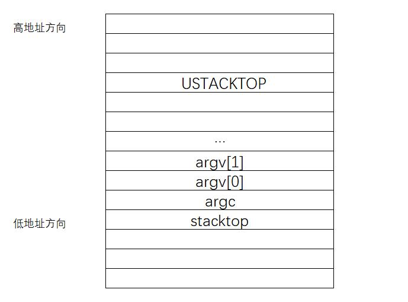

# Lab8实验报告

## 一.实验目的

- 了解基本的文件系统系统调用的实现方法；
- 了解一个基于索引节点组织方式的Simple FS文件系统的设计与实现；
- 了解文件系统抽象层-VFS的设计与实现；

## 二.实验内容

### 练习1：完成读文件操作的实现

#### 1.Simple FS 文件系统

​		**文件类型**

​		ucore中使用的具体文件系统为Simple FS文件系统。ucore内核将所有文件都看作为字节流，由应用程序进行解释。ucore支持以下几种类型的文件：

- 常规文件：文件中包括的内容信息是由应用程序输入。SFS文件系统在普通文件上不强加任何内部结构，把其文件内容信息看作为字节。
- 目录：包含一系列的entry，每个entry包含文件名和指向与之相关联的索引节点（index node）的指针。
- 链接文件：实际上一个链接文件是一个已经存在的文件的另一个可选择的文件名。
- 设备文件：不包含数据，但是提供了一个映射物理设备（如串口、键盘等）到一个文件名的机制。可通过设备文件访问外围设备。
- 管道：管道是进程间通讯的一个基础设施。管道缓存了其输入端所接受的数据，以便在管道输出端读的进程能一个先进先出的方式来接受数据。

​		**文件系统的布局**


​		其中超级块记录了文件系统的相关信息，包括检验磁盘镜像是否合法的魔数，全部的块数量和未使用的块数量及文件系统名。第1个块中存放的是根目录的相关信息，所有文件都可以通过根目录找到。然后是数据位图和inode位图的块freemap。最后，剩余的块中保存了inode信息以及所有的数据块。操作系统调用sfs_do_mount函数，完成加载位于硬盘上的SFS文件系统的超级块superblock和freemap的工作，从而获得文件系统的必要信息，能够使用文件系统。

​		**磁盘索引节点**

​		SFS中的磁盘索引节点代表了一个实际位于磁盘上的文件，索引节点保存了文件的所有信息，包括文件类型(是否为目录)，文件的数据块个数，以及指向文件数据块的直接和间接指针。

```c
struct sfs_disk_inode {
    uint32_t size;                              	//如果inode表示常规文件，则size是文件大小
    uint16_t type;                                  //inode的文件类型
    uint16_t nlinks;                                //此inode的硬链接数
    uint32_t blocks;                                //此inode的数据块数的个数
    uint32_t direct[SFS_NDIRECT];                   //此inode的直接数据块索引值（有SFS_NDIRECT个）
    uint32_t indirect;                              //此inode的一级间接数据块索引值
};
```

​		操作系统中，每个文件系统下的 inode 都应该分配唯一的 inode 编号。SFS  下，为了实现简便，一个数据块只保存一个inode。每个 inode 直接使用磁盘 block 的编号作为 inode 编号。

​		对于普通文件，索引值指向的 block 中保存的是文件中的数据。而对于目录，索引值指向的数据保存的是目录下所有的文件名以及对应的索引节点所在的索引块（磁盘块）所形成的数组。数据结构如下：

```c
/* file entry (on disk) */
struct sfs_disk_entry {
    uint32_t ino;                                   //索引节点所占数据块索引值
    char name[SFS_MAX_FNAME_LEN + 1];               //文件名
};
```

​		**内存中的索引节点**

​		在内存中，操作系统还使用一个inide结构保存文件信息。这个内存中的inode包含了磁盘inode，还添加了信号量，标志位等信息，以便进行互斥操作，判断是否改写等工作。内存inode只有在打开文件后才创建，关机后信息就会消失。

```c
/* inode for sfs */
struct sfs_inode {
    struct sfs_disk_inode *din;                     /* on-disk inode */
    uint32_t ino;                                   /* inode number */
    uint32_t flags;                                 /* inode flags */
    bool dirty;                                     /* true if inode modified */
    int reclaim_count;                              /* kill inode if it hits zero */
    semaphore_t sem;                                /* semaphore for din */
    list_entry_t inode_link;                        /* entry for linked-list in sfs_fs */
    list_entry_t hash_link;                         /* entry for hash linked-list in sfs_fs */
};
```

​		为了实现多级数据的访问以及目录中 entry 的操作，SFS实现了一些相关的函数，实现的功能包括查找文件，更新目录，释放目录中的entry等。

​		**inode的文件操作函数**

​		对inode索引的文件的相关操作主要是打开与关闭文件，对文件的读写。打开文件不需要做其他工作。关闭文件需要将对文件的修改写入硬盘。而读写则调用sfs_io，通过访问硬盘驱动来完成对文件数据的读写。

```c
static const struct inode_ops sfs_node_fileops = {
    .vop_magic                      = VOP_MAGIC,
    .vop_open                       = sfs_openfile,
    .vop_close                      = sfs_close,
    .vop_read                       = sfs_read,
    .vop_write                      = sfs_write,
    ……
};
```

​		**inode的目录操作函数**

​		对于目录操作而言，由于目录也是一种文件，所以sfs_opendir、sys_close对应户进程发出的open、close函数。相对于sfs_open，sfs_opendir只是完成一些open函数传递的参数判断。目录的close操作与文件的close操作完全一致。由于目录的内容数据与文件的内容数据不同，所以读出目录的内容数据的函数是sfs_getdirentry，其主要工作是获取目录下的文件inode信息。

```c
static const struct inode_ops sfs_node_dirops = {
    .vop_magic                      = VOP_MAGIC,
    .vop_open                       = sfs_opendir,
    .vop_close                      = sfs_close,
    .vop_getdirentry                = sfs_getdirentry,
    .vop_lookup                     = sfs_lookup,                 
    ……
};
```

#### 2.ucore文件系统

##### (1)**总体结构**

​		ucore模仿了UNIX的文件系统设计，ucore的文件系统架构主要由四部分组成：

- 通用文件系统访问接口层：该层提供了一个从用户空间到文件系统的标准访问接口，让应用程序能够通过一个简单的接口获得ucore内核的文件系统服务。
- 文件系统抽象层：向上提供一个一致的接口给内核其他部分（文件系统相关的系统调用实现模块和其他内核功能模块）访问。向下提供一个同样的抽象函数指针列表和数据结构屏蔽不同文件系统的实现细节。
- Simple FS文件系统层：一个基于索引方式的简单文件系统实例。向上通过各种具体函数实现以对应文件系统抽象层提出的抽象函数。向下访问外设接口
- 外设接口层：向上提供device访问接口屏蔽不同硬件细节。向下实现访问各种具体设备驱动的接口，比如disk设备接口/串口设备接口/键盘设备接口等。

​		根据以上的ucore文件系统架构，应用程序对文件的访问步骤如下：首先需要通过文件系统的通用文件系统访问接口层给用户空间提供的访问接口进入文件系统，由文件系统抽象层把访问请求转发给某一具体文件系统，具体文件系统（Simple FS文件系统层）把应用程序的访问请求转化为对磁盘上的block的处理请求，并通过外设接口层交给磁盘驱动例程来完成具体的磁盘操作。

​		**文件系统的数据结构**

​		ucore中的文件系统架构包含四类主要的数据结构, 它们分别是：

- 超级块（SuperBlock）：从文件系统的全局角度描述特定文件系统的全局信息。作用范围是整个OS空间。
- 索引节点（inode）：从文件系统的单个文件的角度描述了文件的各种属性和数据所在位置。作用范围是整个OS空间。
- 目录项（dentry）：从文件系统的文件路径的角度描述了文件路径中的特定目录。作用范围是整个OS空间。
- 文件（file）：从进程的角度描述了一个进程在访问文件时需要了解的文件标识，文件读写的位置，文件引用情况等信息。作用范围是某一具体进程。

##### (2)通用文件系统访问接口

​		操作系统提供了系统调用，使进程能够对文件进行操作。这些系统调用中最基本的相关函数是open、close、read、write。在读写一个文件之前，首先用open系统调用将其打开。open中的参数为指定文件的路径名，打开的方式（只读、只写、可读可写），返回一个文件描述符，通过文件描述符可以对文件进行使用。使用完一个文件后，要用close系统调用把它关闭，参数为文件描述符fd。而读写文件的函数为read与write。open，read，write，close函数都是封装好的用户库函数，对应的系统调用函数为sys_open、sys_close、sys_read、sys_write。通过syscall发起系统调用，在内核中进一步使用文件系统抽象层的接口。

##### (3)**文件系统抽象层（VFS）**

​		文件系统抽象层是把不同文件系统的对外接口提取出来，形成一个函数指针数组，这样，通用文件系统访问接口层只需访问文件系统抽象层，而不需关心具体文件系统的实现细节和接口。

​		file&dir接口层定义了进程在内核中直接访问的文件相关信息，这定义在file数据结构中。为了记录进程访问的文件相关信息，进程控制块中添加了进程访问文件的数据接口fs_struct，该结构中保存了进程执行目录的inode指针，一个file结构的数组用于记录所有使用的文件，还有信号量用于保证对进程控制块中fs_struct的互斥访问。创建一个进程后，该进程的fs_struct将会被初始化或复制父进程的fs_struct。当用户进程打开一个文件时，将从filemap数组中取得一个空闲file项，然后会把此file的成员变量inode指针指向一个代表此文件的inode地址。

```c
//file结构用于记录进程访问的文件信息
struct file {
    enum {
        FD_NONE, FD_INIT, FD_OPENED, FD_CLOSED,
    } status;                          		//访问文件的执行状态
    bool readable;                    		//文件是否可读
    bool writable;                     		//文件是否可写
    int fd;                           		//文件在filemap中的索引值
    off_t pos;                        		//访问文件的当前位置
    struct inode *node;               		//该文件对应的内存inode指针
    atomic_t open_count;              		//打开此文件的次数
};
//进程中的fs_struct
struct fs_struct {
    struct inode *pwd;                		//进程当前执行目录的内存inode指针
    struct file *filemap;             		//进程打开文件的数组
    atomic_t fs_count;                		//访问此文件的线程个数
    semaphore_t fs_sem;                		//确保对进程控制块中fs_struct的互斥访问
};
```

​		inode

​		index node是位于内存的索引节点，它是VFS结构中的重要数据结构，负责把不同文件系统的特定索引节点信息统一封装起来，避免了进程直接访问具体文件系统。其定义如下：

```c
struct inode {
    union {                                 	//包含不同文件系统特定inode信息的union成员变量
        struct device __device_info;          	//设备文件系统内存inode信息
        struct sfs_inode __sfs_inode_info;    	//SFS文件系统内存inode信息
    } in_info;   
    enum {
        inode_type_device_info = 0x1234,
        inode_type_sfs_inode_info,
    } in_type;                         			//此inode所属文件系统类型
    atomic_t ref_count;                 		//此inode的引用计数
    atomic_t open_count;                		//打开此inode对应文件的个数
    struct fs *in_fs;                   		//抽象的文件系统，包含访问文件系统的函数指针
    const struct inode_ops *in_ops;     		//抽象的inode操作，包含访问inode的函数指针     
};
```

​		其中的成员变量in_ops是对此inode的操作函数指针列表。这些函数最终会通过具体的SFS文件系统的相关接口完成对应的文件相关操作。

```c
struct inode_ops {
    unsigned long vop_magic;
    int (*vop_open)(struct inode *node, uint32_t open_flags);
    int (*vop_close)(struct inode *node);
    int (*vop_read)(struct inode *node, struct iobuf *iob);
    int (*vop_write)(struct inode *node, struct iobuf *iob);
	……
};
```

##### (4)**外设接口层**

​		ucore一个设备看成一个文件，通过访问文件的接口来访问设备。ucore实现了stdin设备文件文件、stdout设备文件、disk0设备。stdin设备就是键盘，stdout设备就是CONSOLE（串口、并口和文本显示器），而disk0设备是承载SFS文件系统的磁盘设备。

​		为了表示一个设备，需要有对应的数据结构，ucore为此定义了struct device，其中包含了打开关闭，读写设备的函数指针，以及设备占用数据块数量等。这些函数就是底层的设备I/O接口。为了方便操作系统管理，设备结构中包含链表节点，所有设备链接到一个链表上。为了把设备和文件系统联系起来，ucore中定义了一个数据结构vfs_dev_t：

```c
// device info entry in vdev_list 
typedef struct {
    const char *devname;
    struct inode *devnode;										//inode
    struct fs *fs;											
    bool mountable;
    list_entry_t vdev_link;
} vfs_dev_t;
```

​		利用vfs_dev_t数据结构，文件系统就可以通过链接vfs_dev_t结构的双向链表找到device对应的inode数据结构，一个inode节点的成员变量in_type的值是0x1234，则此 inode的成员变量in_info将成为一个device结构。这样inode就和一个设备建立了联系，这个inode指向的就是一个设备文件。

​		**stdout设备文件**

​		stdout设备文件指的是console外设（它其实是串口、并口和CGA的组合型外设）。这个设备文件是一个只写设备，如果读这个设备，就会出错。将设备添加到文件系统，需要按照以下的顺序进行初始化：

```c
kern_init-->fs_init-->dev_init-->dev_init_stdout --> dev_create_inode
                 --> stdout_device_init
                 --> vfs_add_dev
```

​		对设备写的工作由stdout_io函数完成，该函数的参数为设备和iobuf结构，以及io操作。stdout只能进行写操作，会调用cputchar将iobuf中的数据写入设备，cputchar会通过设备驱动完成写入。

```c
static int
stdout_io(struct device *dev, struct iobuf *iob, bool write) {
    if (write) {
        char *data = iob->io_base;
        for (; iob->io_resid != 0; iob->io_resid --) {
            cputchar(*data ++);								//写入数据
        }
        return 0;
    }
    return -E_INVAL;										//对stdout读则返回错误
}
```

​		**stdint设备文件**

​		stdin设备文件实际上就是指的键盘。这个设备文件是一个只读设备，如果写这个设备，就会出错。与stdout设备类似，需要进行初始化后才能在文件系统中使用。相比于stdout的初始化，stdin_device_init中增加了stdin_buffer缓冲区，描述缓冲区读写位置的变量p_rpos、p_wpos以及用于等待缓冲区的等待队列wait_queue的初始化。

​		对设备写的工作由stdout_io函数完成，与stdout的写不同的是，读取通过进一步调用dev_stdin_read完成。dev_stdin_read中完成的工作比较复杂。在该函数中会比较p_rpos和p_wpos，如果p_rpos <  p_wpos，则表示有键盘输入的新字符在stdin_buffer中，于是就从stdin_buffer中取出新字符放到iobuf指向的缓冲区中；如果p_rpos  >=p_wpos，则表明没有新字符，这样调用read用户态库函数的用户进程就需要采用等待队列的睡眠操作进入睡眠状态，等待键盘输入字符的产生。当键盘输入字符时，将触发键盘中断，唤醒正在等待键盘输入的用户进程。

```c
static int
stdin_io(struct device *dev, struct iobuf *iob, bool write) {
    if (!write) {
        int ret;
        if ((ret = dev_stdin_read(iob->io_base, iob->io_resid)) > 0) {
            iob->io_resid -= ret;
        }
        return ret;
    }
    return -E_INVAL;
}
```

#### 3.文件操作实现

​		Lab8实现了上述文件系统，并会在操作系统启动时进行文件系统的初始化。具体的初始化是从kern_init调用fs_init开始，这个函数是文件系统初始化的总控函数，在该函数中，将调用虚拟文件系统初始化函数vfs_init，与文件相关的设备初始化函数dev_init和Simple FS文件系统的初始化函数sfs_init，完成虚拟文件系统，SFS文件系统和文件系统对应的设备初始化工作。在完成这些初始化工作之后，ucore的文件系统就可以使用了，输入输出设备也可以通过文件系统进行访问。

##### (1)打开文件

​		用户进程打开文件是首先通过用户态函数进行调用的。在**通用文件访问接口层**，通过open->sys_open->syscall发起系统调用进入内核态，在内核的sys_open中进一步调用sysfile_open函数，并把访问路径字符串拷贝到内核空间的字符串path中，接下来进入文件系统抽象层进行处理。

```c
int
sysfile_open(const char *__path, uint32_t open_flags) {
    int ret;
    char *path;
    if ((ret = copy_path(&path, __path)) != 0) {
        return ret;
    }
    ret = file_open(path, open_flags);				//此处开始为文件系统抽象层进行的处理
    kfree(path);
    return ret;
}
```

​		**文件系统抽象层**的处理是从file_open函数开始的。文件系统抽象层需要用数据结构记录打开文件的信息，因此首先分配一个file数据结构的变量，这个变量保存在进程控制块的fs_struct->filemap[]中，从而表示该进程打开了该文件，最后将这个数据结构在filemap中的索引值返回给用户进程。打开一个文件更重要的一步是找到文件的索引节点，因此在file_open中调用vfs_open，该函数将找到对应文件的inode，并调用vop_open函数打开该文件。

```c
int
file_open(char *path, uint32_t open_flags) {
	打开模式判断及file结构建立......
    struct inode *node;
    if ((ret = vfs_open(path, open_flags, &node)) != 0) {	//找到该文件的inode索引并打开
        fd_array_free(file);
        return ret;
    }
	file结构的设置等......
}
```

​		vfs_open函数是通过调用vop_lookup函数来查找文件的索引节点，这个查找工作最终由SFS文件系统层完成，将返回文件对应的索引节点。在file_open中将file->node设置为返回的索引节点inode，并层层返回。文件打开完成，现在进程可以通过控制块中的file结构找到文件的索引节点，并对其进行读写了。

​		在sfs_inode.c中的sfs_node_dirops变量定义了.vop_lookup = sfs_lookup，即查找交给**SFS文件系统层**来完成。在sfs_lookup中，以/为分隔符分解path，获得子目录和文件对应的inode节点。寻找子目录的对应inode节点调用sfs_lookup_once完成，当子目录一级一级分解，最终找到的就是文件对应的inode节点。在sfs_lookup_once中，调用sfs_dirent_search_nolock函数查找与路径名匹配的目录项，如果找到目录项，根据目录项记录的inode找到对应的SFS磁盘inode，读入磁盘inode的内容，并创建内存inode。

​		通过以上的一系列调用，就实现了从用户态开始，发起系统调用，按照通用文件访问接口->文件系统抽象层接口->SFS文件系统接口完成了文件的打开，并返回以及记录了磁盘上该文件的inode索引节点。索引节点还会保存到SFS文件系统的内存inode中，便于使用。

##### (2)读文件(练习：sfs_io_nolock的实现)

​		读文件是在已打开文件的基础上进行的。读取文件需要三个参数，文件描述符，读取长度及读取到的位置。与打开文件类似，首先在**通用文件访问接口层**，通过用户态函数read，按照read->sys_read->syscall的顺序进入内核，然后通过系统调用sys_read->sysfile_read，进入文件系统抽象层处理。

​		在**文件系统抽象层**中，进行实际读取前还要检查错误，检查读取长度是否为0以及文件是否可读。检查后，先调用kmalloc分配一个buffer空间，用于文件的读取。接下来循环读取文件，每次读取buffer大小(或剩余不足buffer的大小)。读取是通过调用file_read完成的，读取到buffer后，再将读到的内容调用copy_to_user函数拷贝到用户指定的内存空间。循环读取，直至指定长度读取完成。

```c
int
sysfile_read(int fd, void *base, size_t len) {
    struct mm_struct *mm = current->mm;
    if (len == 0) {
        return 0;
    }
    if (!file_testfd(fd, 1, 0)) {							//确认文件已打开
        return -E_INVAL;
    }
    void *buffer;									
    if ((buffer = kmalloc(IOBUF_SIZE)) == NULL) {			//分配buffer的空间
        return -E_NO_MEM;
    }

    int ret = 0;
    size_t copied = 0, alen;								//读取大小
    while (len != 0) {
        if ((alen = IOBUF_SIZE) > len) {
            alen = len;
        }
        ret = file_read(fd, buffer, alen, &alen);			//读取到buffer
        if (alen != 0) {
            lock_mm(mm);
            {
                if (copy_to_user(mm, base, buffer, alen)) {	//拷贝到用户内存空间
                    assert(len >= alen);
                    base += alen, len -= alen, copied += alen;
                }
                else if (ret == 0) {
                    ret = -E_INVAL;
                }
            }
            unlock_mm(mm);
        }
        if (ret != 0 || alen == 0) {
            goto out;
        }
    }
out:
    kfree(buffer);
    if (copied != 0) {
        return copied;
    }
    return ret;
}
```

​		file_read函数是读取的核心函数，四个参数分别为文件描述符，缓存基地址，读取长度，存放读取的实际长度的地址。函数首先调用fd2file找到文件的file结构，检查是否可读，调用filemap_acquire函数使打开这个文件的计数加1。然后调用vop_read函数将文件内容读到iob，调整文件指针偏移量pos的值，使其向后移动实际读到的字节数iobuf_used(iob)。最后调用filemap_release函数使打开这个文件的计数减1，若打开计数为0，则释放file。

```c
int
file_read(int fd, void *base, size_t len, size_t *copied_store) {
	找到file结构，判断文件是否可读......
    struct iobuf __iob, *iob = iobuf_init(&__iob, base, len, file->pos);
    ret = vop_read(file->node, iob);							//vop_read完成读取
	调整指针偏移量，计数-1......
}
```

​		具体的读取由**SFS文件系统层**来完成。vop_read函数实际上是对sfs_read的包装。在sfs_inode.c中sfs_node_fileops变量定义了.vop_read = sfs_read，接下来分析sfs_read函数的实现。sfs_read有三个参数，node是对应文件的inode，iob是保存读取文件内容的缓冲区，write表示是读还是写的布尔值（0表示读，1表示写），这里是0。sfs_io函数先找到inode对应sfs(SFS文件系统结构)和sin(内存中的inode索引节点)，然后调用sfs_io_nolock函数进行读取文件操作，最后调用iobuf_skip函数调整iobuf的指针。

```c
//SFS系统层的sfs_read，完成文件内容的读取
static int
sfs_read(struct inode *node, struct iobuf *iob) {
    return sfs_io(node, iob, 0);
}
//sfs_io
static inline int
sfs_io(struct inode *node, struct iobuf *iob, bool write) {
    struct sfs_fs *sfs = fsop_info(vop_fs(node), sfs);				//文件系统结构
    struct sfs_inode *sin = vop_info(node, sfs_inode);				//内存中的inode索引节点
    int ret;
    lock_sin(sin);
    {
        size_t alen = iob->io_resid;
        ret = sfs_io_nolock(sfs, sin, iob->io_base, iob->io_offset, &alen, write);
        if (alen != 0) {
            iobuf_skip(iob, alen);									//调整iobuf指针
        }
    }
    unlock_sin(sin);
    return ret;
}
```

​		**sfs_io_nolock的实现**

​		sfs_io_nolock函数将完成读取操作。sfs_io_nolock函数的参数为SFS文件系统的sfs_fs结构，文件在SFS中建立的内存inode，缓冲区buf，文件偏移，读取长度，读写标志。在开始读取前，首先计算一些辅助变量，检查读取是否越界，并取出磁盘的inode。接下来sfs_buf_op = sfs_rbuf，sfs_block_op = sfs_rblock，设置读取的函数为实际的函数操作。

```c
static int
sfs_io_nolock(struct sfs_fs *sfs, struct sfs_inode *sin, void *buf, off_t offset, size_t *alenp, bool write) {
    struct sfs_disk_inode *din = sin->din;					//取出磁盘inode
    assert(din->type != SFS_TYPE_DIR);						//确定为文件
    off_t endpos = offset + *alenp, blkoff;					//计算结束位置
    *alenp = 0;												//设置已读取到的长度为0
	// calculate the Rd/Wr end position
    if (offset < 0 || offset >= SFS_MAX_FILE_SIZE || offset > endpos) {
        return -E_INVAL;
    }
    if (offset == endpos) {
        return 0;
    }
    if (endpos > SFS_MAX_FILE_SIZE) {
        endpos = SFS_MAX_FILE_SIZE;
    }
    if (!write) {
        if (offset >= din->size) {
            return 0;
        }
        if (endpos > din->size) {
            endpos = din->size;
        }
    }

    int (*sfs_buf_op)(struct sfs_fs *sfs, void *buf, size_t len, uint32_t blkno, off_t offset);
    int (*sfs_block_op)(struct sfs_fs *sfs, void *buf, uint32_t blkno, uint32_t nblks);
    if (write) {
        sfs_buf_op = sfs_wbuf, sfs_block_op = sfs_wblock;
    }
    else {
        sfs_buf_op = sfs_rbuf, sfs_block_op = sfs_rblock;	//设置实际的操作函数
    }
```

​		进行好设置后，就开始实际的读操作。读取之前通过计算了开始读取的块号(**blkno**)，以及读取的块数(**nblks**)。读取时需要分三部分进行读取，第一部分是先处理起始的没有对齐到块的部分，再以块为单位循环处理中间的部分，最后处理末尾剩余的部分。每部分中都调用sfs_bmap_load_nolock函数得到blkno对应的inode编号，并调用sfs_rbuf或sfs_rblock函数读取数据（中间部分调用sfs_rblock，起始和末尾部分调用sfs_rbuf），调整相关变量。完成后如果offset + alen >  din->fileinfo.size（写文件时会出现这种情况，读文件时不会出现这种情况，alen为实际读写的长度），则调整文件大小为offset + alen并设置dirty变量。

​		需要调用的函数如下：

​		sfs_bmap_load_nolock：获取blkno对应的inode指向的起始块号，返回到ino中。

```c
static int
sfs_bmap_load_nolock(sfs, sin, blkno, &ino);
```

​		sfs_buf_op(即sfs_rbuf)：从块的offset开始读取size大小的数据到buf

```c
int
sfs_rbuf(struct sfs_fs *sfs, void *buf, size_t len, uint32_t blkno, off_t offset);
```

​		sfs_block_op(即sfs_rblock)：从nlkno开始读取nblk个块的数据到buf

```c
int
sfs_rblock(struct sfs_fs *sfs, void *buf, uint32_t blkno, uint32_t nblks)
```

​		每部分读取前都调用sfs_bmap_load_nolock函数得到blkno对应的inode编号。读取后blkno++，nblks--，即调整读取块的编号及需要读取的块数。首先直接调用sfs_buf_op读取不对齐的部分，然后循环调用sfs_block_op，按块读取文件内容，最后endpos % SFS_BLKSIZE计算是否有多出来的部分，再调用sfs_buf_op读取这最后一部分的内容，就完成了全部的读取。返回前还检查了最后的文件位置是否比数据块原有数据大小更大，如果更大则需要更新大小，在读中不需要更新。

```c
    int ret = 0;
    size_t size, alen = 0;
    uint32_t ino;
    uint32_t blkno = offset / SFS_BLKSIZE;          // The NO. of Rd/Wr begin block
    uint32_t nblks = endpos / SFS_BLKSIZE - blkno;  // The size of Rd/Wr blocks
	/* 起始不与块对齐的部分 */
    if ((blkoff = offset % SFS_BLKSIZE) != 0) {								
        //起始部分的大小，需要考虑读取大小小于一个块的情况(小于一个块则size=endpos-offset)
        size = (nblks != 0) ? (SFS_BLKSIZE - blkoff) : (endpos - offset);	
        if ((ret = sfs_bmap_load_nolock(sfs, sin, blkno, &ino)) != 0) {
            goto out;
        }
        if ((ret = sfs_buf_op(sfs, buf, size, ino, blkoff)) != 0) {
            goto out;
        }
        alen += size;								//读取到的长度
        if (nblks == 0) {							//大小小于一个块，读取结束
            goto out;
        }
        buf += size;
        blkno ++;
        nblks --;
    }
	/* 按块读取，size为SFS_BLKSIZE */
    size = SFS_BLKSIZE;
    while (nblks != 0) {
        if ((ret = sfs_bmap_load_nolock(sfs, sin, blkno, &ino)) != 0) {
            goto out;
        }
        if ((ret = sfs_block_op(sfs, buf, ino, 1)) != 0) {
            goto out;
        }
        alen += size;
        buf += size;
        blkno ++;
        nblks --;				//更新读到的大小和剩余需要读取块数
    }
	/* 读取最后一部分 */
    if ((size = endpos % SFS_BLKSIZE) != 0) {
        if ((ret = sfs_bmap_load_nolock(sfs, sin, blkno, &ino)) != 0) {
            goto out;
        }
        if ((ret = sfs_buf_op(sfs, buf, size, ino, 0)) != 0) {		//偏移为0，大小为size
            goto out;
        }
        alen += size;
    }
out:
    *alenp = alen;
    if (offset + alen > sin->din->size) {							//如果大于磁盘数据块已有大小
        sin->din->size = offset + alen;								//更新大小
        sin->dirty = 1;												//标记为修改过
    }
    return ret;
}
```

### 4.PIPE机制

​		pipe机制是进程间通信的一种方式。也是一种特殊的文件。这个文件的特点是一个进程向其写入数据，另一个进程从中读取数据，从而实现进程间的通信。pipe本身也是一种文件，因此操作系统可以在文件系统初始化时，设置一个文件，使用该文件作为管道，以类似设备的方式将其作为特殊文件进行访问和管理。操作系统应该具有对这个文件的管理权，因此需要有对应的pipe结构以及pipe管理结构(包含pipe文件的管理，读写控制函数)，并为进程提供系统调用使用pipe机制。系统调用需要包括：

- 打开pipe机制的系统调用：即打开pipe文件，并返回相应的文件描述符，在fork时，子进程会复制父进程的文件描述符，因此相当于同样打开了pipe文件，进程就可以通过pipe读写进行通信。

- 读取pipe内容：与读取文件的方式应该相同，但操作系统应该设置进程同步
- 写pipe：向pipe中写入数据
- 建立pipe的系统调用：打开pipe文件的方式只能让父子进程进行通信，如果要让无关联的进程进行通信，需要由操作系统打开pipe，将文件描述符交给两个进程，使两个进程能够实现通信

​		实现PIPE机制要考虑的实际问题可能更多，由于对pipe实现以及文件系统实现本身的理解还不够，只能给出以上的实现pipe机制的基本方式。

### 练习2：完成基于文件系统的执行程序机制的实现

#### 1.基于文件系统的执行程序机制的实现

​		练习二要求改写proc.c中的load_icode函数和其他相关函数，实现基于文件系统的执行程序机制。需要改写的主要有三处：alloc_proc函数，load_icode函数，do_fork函数。

​		首先补充alloc_proc函数。由于在lab8引入了文件系统，每个进程的进程控制块都添加了一个指针指向一个fs_struct，记录进程相关的文件信息。因此在分配进程控制块时要对该指针进行初始化。

````c
static struct proc_struct * alloc_proc(void) {  
	struct proc_struct *proc = kmalloc(sizeof(struct proc_struct));  
	if (proc != NULL) {  
		......
    	proc->filesp = NULL;     //初始化fs_struct的指针
	}
    return proc;
}
````

​		相应的，do_fork函数也要修改，子进程需要复制父进程的文件相关信息。为此需要新创建一个fs_struct结构，并将父进程fs_struct中的内容复制到子进程的fs_struct中。在proc.c中已经提供了实现进程文件信息复制的函数copy_files，在do_fork中调用该函数让子进程复制父进程的fs_struct，如果没有复制成功，要处理已分配的fs_struct。

```c
//复制fs_struct
static int
copy_files(uint32_t clone_flags, struct proc_struct *proc);
//减少fs_struct的引用计数，计数为0则删除
static void
put_files(struct proc_struct *proc);
//do_fork中的修改
int
do_fork(uint32_t clone_flags, uintptr_t stack, struct trapframe *tf) {
	分配proc_struct，分配内核栈......
    //将当前进程的fs复制给fork子进程
    if (copy_files(clone_flags, proc) != 0) {
        goto bad_fork_cleanup_kstack;
    }
	复制内存空间等......
fork_out:
    return ret;
bad_fork_cleanup_fs:  //复制失败处理
    put_files(proc);
bad_fork_cleanup_kstack:
    put_kstack(proc);
bad_fork_cleanup_proc:
    kfree(proc);
    goto fork_out;
}
```

​		最后一个要修改的是load_icode函数。load_icode是在do_execve中调用的函数，完成的是用户程序的加载工作。在之前的实验中，由于操作系统没有文件系统，文件都是链接在内核末尾，直接加载到内存当中的，因此传入load_icode的参数为用户程序的elf所在的地址。在本实验中，已经建立了可用的文件系统，加载用户程序的方式应该是从文件系统中找到用户程序文件，再将用户程序加载到内存的地址空间当中。

​		首先比较do_execve函数的实现发生了什么变化。首先，Lab8中的do_execve不需要再传入用户程序的起始地址和大小，因为此时用户程序以文件的方式保存在文件系统中，且do_execve可以接收参数。其次，为了加载用户程序，需要到文件系统中找到用户程序文件将其打开，因此Lab8的do_execve中定义了一个文件描述符，调用sysfile_open，传入用户程序路径，打开用户程序。打开文件后保存的这个文件描述符将传入load_icode，从用户程序的文件中加载用户程序到虚拟地址空间。

```c
//La8之前的do_execve
int
do_execve(const char *name, size_t len, unsigned char *binary, size_t size);
//Lab8中的do_execve
int
do_execve(const char *name, int argc, const char **argv) {
    ......
	/* sysfile_open will check the first argument path, thus we have to use a user-space pointer, and argv[0] may be incorrect */    
    int fd;
    if ((ret = fd = sysfile_open(path, O_RDONLY)) < 0) {
        goto execve_exit;
    }
    ......
}
```

​		对load_icode不需要进行重写，只需要在之前实验实现的load_icode的基础上进行修改。与之前的load_icode比较，只是用户程序的来源不同，建立新的页目录，分配内存空间，设置用户栈等操作都相同。因此只有加载用户程序的部分需要从文件中读取用户程序数据，读取工作可以通过load_icode_read来完成。该函数通过文件描述符，从文件中结合传入的偏移offset，将len长度的内容读取到buf当中。

```c
//读取文件内容到buf
static int
load_icode_read(int fd, void *buf, size_t len, off_t offset) {
    int ret;
    if ((ret = sysfile_seek(fd, offset, LSEEK_SET)) != 0) {
        return ret;
    }
    if ((ret = sysfile_read(fd, buf, len)) != len) {
        return (ret < 0) ? ret : -1;
    }
    return 0;
}
```

​		加载过程中需要加载elf程序的elfhdr，以及从中获取proghdr，并加载用户程序的具体数据，这三步都需要从文件中读取数据，调用load_icode完成，加载的部分如下：

```c
static int
load_icode(int fd, int argc, char **kargv) {
    assert(argc >= 0 && argc <= EXEC_MAX_ARG_NUM);
    if (current->mm != NULL) {
        panic("load_icode: current->mm must be empty.\n");
    }
    int ret = -E_NO_MEM;
    //分配mm_struct
    struct mm_struct *mm;
    if ((mm = mm_create()) == NULL) {
        goto bad_mm;
    }
    if (setup_pgdir(mm) != 0) {					//设置新的页表
        goto bad_pgdir_cleanup_mm;
    }
    
    struct Page *page;
    //从文件中读取ELF header
    struct elfhdr __elf, *elf = &__elf;
    if ((ret = load_icode_read(fd, elf, sizeof(struct elfhdr), 0)) != 0) {
        goto bad_elf_cleanup_pgdir;
    }
    //检验elf文件
    if (elf->e_magic != ELF_MAGIC) {
        ret = -E_INVAL_ELF;
        goto bad_elf_cleanup_pgdir;
    }
    //分配内存空间
    struct proghdr __ph, *ph = &__ph;
    uint32_t vm_flags, perm, phnum;
    for (phnum = 0; phnum < elf->e_phnum; phnum ++) {
        //从文件偏移到proghdr的位置处读取各个程序段的信息
        off_t phoff = elf->e_phoff + sizeof(struct proghdr) * phnum;
        if ((ret = load_icode_read(fd, ph, sizeof(struct proghdr), phoff)) != 0) {
            goto bad_cleanup_mmap;
        }
        if (ph->p_type != ELF_PT_LOAD) {
            continue ;
        }
        if (ph->p_filesz > ph->p_memsz) {
            ret = -E_INVAL_ELF;
            goto bad_cleanup_mmap;
        }
        if (ph->p_filesz == 0) {
            continue ;
        }
        vm_flags = 0, perm = PTE_U;
        if (ph->p_flags & ELF_PF_X) vm_flags |= VM_EXEC;
        if (ph->p_flags & ELF_PF_W) vm_flags |= VM_WRITE;
        if (ph->p_flags & ELF_PF_R) vm_flags |= VM_READ;
        if (vm_flags & VM_WRITE) perm |= PTE_W;
        // 为当前段分配虚拟内存空间
        if ((ret = mm_map(mm, ph->p_va, ph->p_memsz, vm_flags, NULL)) != 0) {
            goto bad_cleanup_mmap;
        }
        off_t offset = ph->p_offset;
        size_t off, size;
        uintptr_t start = ph->p_va, end, la = ROUNDDOWN(start, PGSIZE);

        ret = -E_NO_MEM;

        end = ph->p_va + ph->p_filesz;
        while (start < end) {
            // 设置页表项
            if ((page = pgdir_alloc_page(mm->pgdir, la, perm)) == NULL) {
                ret = -E_NO_MEM;
                goto bad_cleanup_mmap;
            }
            off = start - la, size = PGSIZE - off, la += PGSIZE;
            if (end < la) {
                size -= la - end;
            }
            //读取elf对应段内的数据到内存中
            if ((ret = load_icode_read(fd, page2kva(page) + off, size, offset)) != 0) {
                goto bad_cleanup_mmap;
            }
            start += size, offset += size;
        }
        end = ph->p_va + ph->p_memsz;
        if (start < la) {
            /* ph->p_memsz == ph->p_filesz */
            if (start == end) {
                continue ;
            }
            off = start + PGSIZE - la, size = PGSIZE - off;
            if (end < la) {
                size -= la - end;
            }
            memset(page2kva(page) + off, 0, size);
            start += size;
            assert((end < la && start == end) || (end >= la && start == la));
        }
        while (start < end) {
            if ((page = pgdir_alloc_page(mm->pgdir, la, perm)) == NULL) {
                ret = -E_NO_MEM;
                goto bad_cleanup_mmap;
            }
            off = start - la, size = PGSIZE - off, la += PGSIZE;
            if (end < la) {
                size -= la - end;
            }
            memset(page2kva(page) + off, 0, size);
            start += size;
        }
    }
    sysfile_close(fd);							//加载完成，关闭文件
```

​		除了加载的修改，还有需要的修改部分是对用户栈的修改。因为在lab8的do_execve中传入了用户程序的参数，load_icode需要将传入的参数放到用户栈当中。首先需要计算参数的字节数，可以通过strnlen计算，这个函数在lib的string.c中，限制了字符串的最大长度。然后将指针stacktop用分配的用户栈顶减去参数及argc所占的空间，定义uargv为参数开始的位置，并逐个将参数逐个strcpy复制到用户栈中，最后放入argc。将更新的用户栈顶stacktop设置为tf_esp。

​		用户栈的建立如下：



​		load_icode中对应的代码部分如下：

```c
	建立用户栈，设置当前进程的mm_struct和页目录为新创建的mm和页目录......
    //setup argc, argv
    uint32_t argv_size=0, i;
    for (i = 0; i < argc; i ++) {
        argv_size += strnlen(kargv[i],EXEC_MAX_ARG_LEN + 1)+1;
    }
    uintptr_t stacktop = USTACKTOP - (argv_size/sizeof(long)+1)*sizeof(long);	//设置新栈顶
    char** uargv=(char **)(stacktop  - argc * sizeof(char *));					//参数起始位置
    argv_size = 0;
    for (i = 0; i < argc; i ++) {
        uargv[i] = strcpy((char *)(stacktop + argv_size ), kargv[i]);		//从低到高设置参数
        argv_size +=  strnlen(kargv[i],EXEC_MAX_ARG_LEN + 1)+1;
    }
    stacktop = (uintptr_t)uargv - sizeof(int);
    *(int *)stacktop = argc;
  
    struct trapframe *tf = current->tf;
    memset(tf, 0, sizeof(struct trapframe));
    tf->tf_cs = USER_CS;
    tf->tf_ds = tf->tf_es = tf->tf_ss = USER_DS;
    tf->tf_esp = stacktop;													//用户栈顶设置
    tf->tf_eip = elf->e_entry;
    tf->tf_eflags = FL_IF;
    ret = 0;
out:
    return ret;
bad_cleanup_mmap:
    exit_mmap(mm);
bad_elf_cleanup_pgdir:
    put_pgdir(mm);
bad_pgdir_cleanup_mm:
    mm_destroy(mm);
bad_mm:
    goto out;
}
```

#### 2.硬链接与软链接机制

​		硬链接与软链接机制是为了方便文件共享实现的两种机制。

​		硬链接(hard link, 也称链接)类似于一个文件的一个或多个文件名。每个文件在磁盘中都有一个inode索引，找到文件内容所在的数据块。而硬链接的方式就是不同的目录下的不同文件名指向同一个inode，从而对同一个文件进行读写等操作。对于文件的inode索引，不会因为硬链接的存在而改变，只记录链接数。大概的实现为：为原文件建立一个硬链接，在文件系统存放的目录中，新增一个sfs_disk_entry ，但这个sfs_disk_entry 中的ino变量即文件的inode索引为原文件的ino，即目录中记录着不同文件名的文件，但文件使用同一个inode，指向磁盘中的同一个文件。这种方式下，硬链接文件名与原文件名指向同一个文件，都可以对文件进行修改。

​		软链接类似于文件的快捷方式。软链接就是一个普通文件，只是数据块内容特殊，数据块中存放的内容是另一文件的inode索引和文件信息，通过这个方式可以快速定位到软链接所指向的文件。软链接可以快速找到文件的inode索引，而软链接本身作为文件的存在，可以放到任何路径下。通过软链接可以访问原文件，进行读写操作，但一旦原文件被删除，软链接的存在就失去了意义，不指向有意义的文件。具体的实现为：创建软链接时在文件系统中新建文件，获取原文件的inode索引及文件名，保存在新建的这个文件中，并需要标记文件类型为软链接。

## 三.实验总结

### 与参考答案的比较

**练习1**

​		与参考答案一致。主要是理解ucore中的文件系统构成，以及了解SFS文件系统。认识从通用文件系统访问接口层到文件系统抽象层，再到具体文件系统，最终到外设接口层调用实现文件访问的过程。对于pipe机制实现的思考题，由于对文件系统还有一部分理解不足的地方，只能简单给出需要完成的基本系统调用。

**练习2**

​		向用户栈传递参数的部分参考答案完成，其余与答案一致。练习2主要是对已有实验中对文件访问相关的部分的修改，最核心的是加载用户程序的load_icode的修改，将其从内存中加载程序的部分改为从文件中读取程序内容。

### 涉及的知识点

- 文件系统架构
- SFS文件系统实现
- PIPE机制
- 基于文件系统的程序加载
- 硬链接与软链接机制

​		本次实验的内容主要是持久性-文件系统的知识，展现了文件系统的实现细节与操作系统利用文件系统的方式。ucore的文件系统也展现了文件系统的完整结构。实验中涉及文件系统细节的部分比较多，在书中，重点关注了inode在内元数据的作用，磁盘中数据的内容分布以及通过inode访问文件的过程，且不涉及具体的扇区，实验中展现了利用元数据管理文件的复杂性。对于ucore文件系统的一些内容和细节在阅读指导书内容和源代码时，还没有能够理解，还需要后续继续学习。

### 未涉及的知识点

​		本实验为ucore最后一个实验，实现了ucore的文件系统。至此，实验已经涉及了ucore的内存空间管理(分段与分页机制，进程虚拟内存空间管理)，进程管理及调度(包括进程调度策略和过程，上下文切换，系统调用等)，并发性问题(信号量，条件变量及管程)，文件系统的内容。已经基本涉及了操作系统的所有重要内容及知识点。