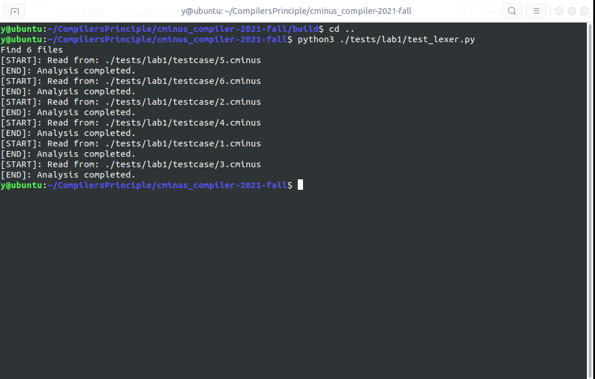
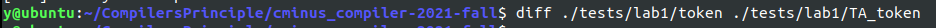
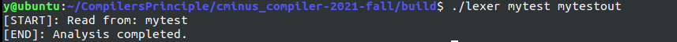

# lab1实验报告
学号：202004061409 姓名：杨鹏宇
## 实验要求

​		根据cminux-f的词法补全[lexical_analyer.l](../../src/lexer/lexical_analyzer.l)文件，完成词法分析器，能够输出识别出的token，type ,line(刚出现的行数)，pos_start(该行开始位置)，pos_end(结束的位置,不包含)。如：

​		文本输入：

```c
 int a;
```

​		则识别结果应为：

```shell
int     280     1       2       5
a       285     1       6       7
;       270     1       7       8
```

## 实验难点

### 1.Flex的使用

​		将词素转换为词法单元有两种方式：第一种是手动用代码实现(需要画状态转移图辅助)，另一种是使用词法分析器生成工具(需要使用正则表达式描述出词素的模式)。而Flex就是一个词法分析器生成工具。词法分析器工具的工作过程如下：

```c
Lex源程序----->Lex编译器----->lex.yy.c
lex.yy.c-----> C编译器 ----->a.out
 输入流  -----> a.out	----->词法单元的序列
```

​		而Lex源程序的格式如下：

```c
声明部分:变量的定义和声明，会直接复制到lex.yy.c中。
%%
转换规则:形式为：模式{动作}，模式为正则表达式，动作则是代码片段。
%%
辅助函数:各个动作需要的辅助函数。用户自定义，直接复制到lex.yy.c末尾。
```

​		Lex中还有一些变量和函数，以下只给出了实验涉及的一部分：

- yyin：FILE*，指向正在解析的文件。

- yyout：FILE*，指向记录lexer输出的位置，缺省时yyin和yyout都指向标准输入和输出流。
- yytext：char*，存储匹配模式的文本。
- yylex()：这一函数开始词法分析，由Lex自动生成。
- yywrap()：这一函数在文件或输入的末尾调用，返回值是1则停止解析。可以通过改变yyin指针指向不同文件，进行多文件的解析。

​		本实验主要是需要完成转换规则部分，给出cminux-f中词法单元的正则表达式和动作。

### 2.识别到词法单元的动作

​		运算符，符号，关键字，ID和NUM类型的词法单元在识别后，需要确定出现的行数，开始位置，结束的位置。出现的行数可以在识别到换行符时lines++实现，开始的位置为上一个识别的词法单元结束的位置，结束的位置为开始位置加上词素长度。最后返回token值结束完成一个词素的识别。因此识别到词法单元的动作如下：

```c
RE {pos_start=pos_end;pos_end=pos_start+strlen(yytext);return token}
```

​		对于运算符，符号和关键字，长度是确定的，可以直接加上长度，不需要调用sterlen。

### 3.识别到特殊词法单元的动作

​		对于注释，空格，换行符，只需要进行识别，不需要输出到分析结果中。这些token与程序运行无关。其中空格对接下来的词法单元无影响，与一般词法单元的动作相同；识别到换行符需要将lines++，并将开始位置置1；识别到注释时，由于注释中内容全部都与程序无关，需要判断注释中是否含有换行符，并将lines加上换行符的个数。因此在识别到这些词法单元时，处理如下：

```c
    int len;
	while(token = yylex()){
        switch(token){
            case COMMENT:
                len = strlen(yytext);
                for(int i=0;i<len;i++){
                    if(yytext[i]=='\n') {
                        lines++;
                        pos_end = 1;	//pos_start由pos_end得到，这里就不需要置1了
                    }
                    else pos_end++;
                }
                break;
            case BLANK:
                break;
            case EOL:
                lines++;
                pos_end = 1;
                break;
            case ERROR:
                printf("[ERR]: unable to analysize %s at %d line, from %d to %d\n", yytext, lines, pos_start, pos_end);
            default :
                if (token == ERROR){
                    sprintf(token_stream[index].text, "[ERR]: unable to analysize %s at %d line, from %d to %d", yytext, lines, pos_start, pos_end);
                } else {
                    strcpy(token_stream[index].text, yytext);
                }
                token_stream[index].token = token;
                token_stream[index].lines = lines;
                token_stream[index].pos_start = pos_start;
                token_stream[index].pos_end = pos_end;
                index++;
                if (index >= MAX_NUM_TOKEN_NODE){
                    printf("%s has too many tokens (> %d)", input_file, MAX_NUM_TOKEN_NODE);
                    exit(1);
                }
        }
    }
```

### 4.注释的正则表达式

​		注释的正则表达式需要注意，因为匹配的原则是最长匹配，但是如果有多个注释，中间的代码会被当作注释的内容匹配：

```c
/*comments*/
int a = 1
/*comments again*/
```

​		因此在进行匹配时，/\*和\*/之间不能有*/，即中间的连续字符可以划分为两种情况：

- 没有出现*：可以表示为\[^\*]
- *后加除/以外的任何字符：\\\*+\[^/]

​		将注释的正则表达式写为"/\*"(\[^\*] | \\\*+\[^\\])+"\*/"，但是这样写出现了一个问题，\*\*\*被匹配到一起了，导致\*和/分离。修改第二种情况为\\\*\[^*/]，将\*\*\*/这种情况放到最后来解决这个问题。最终修改后注释的正则表达式如下：

```C
"/*"([^*]|\*+[^*/])*\*+"/"
```

## 实验设计

​		需要识别的token定义在lexical_analyzer.h中，如下：

```c
typedef enum cminus_token_type {
    //运算
    ADD = 259,
    SUB = 260,
    MUL = 261,
    DIV = 262,
    LT = 263,
    LTE = 264,
    GT = 265,
    GTE = 266,
    EQ = 267,
    NEQ = 268,
    ASSIN = 269,
    //符号
    SEMICOLON = 270,
    COMMA = 271,
    LPARENTHESE = 272,
    RPARENTHESE = 273,
    LBRACKET = 274,
    RBRACKET = 275,
    LBRACE = 276,
    RBRACE = 277,
    //关键字
    ELSE = 278,
    IF = 279,
    INT = 280,
    FLOAT = 281,
    RETURN = 282,
    VOID = 283,
    WHILE = 284,
    //ID和NUM
    IDENTIFIER = 285,
    INTEGER = 286,
    FLOATPOINT = 287,
    ARRAY = 288,
    LETTER = 289,
    //others
    EOL = 290,
    COMMENT = 291,
    BLANK = 292,
    ERROR = 258

} Token;
```

​		在lexical_analyer.l中写出每个词法单元的正则表达式和动作：

```c
\+   {pos_start = pos_end; pos_end++; return ADD;}
\-   {pos_start = pos_end; pos_end++; return SUB;}
\*   {pos_start = pos_end; pos_end++; return MUL;}
\/   {pos_start = pos_end; pos_end++; return DIV;}
\<   {pos_start = pos_end; pos_end++; return LT;}
"<=" {pos_start = pos_end; pos_end+=2; return LTE;}
\>   {pos_start = pos_end; pos_end++; return GT;}
">=" {pos_start = pos_end; pos_end+=2; return GTE;}
"==" {pos_start = pos_end; pos_end+=2; return EQ;}	
"!=" {pos_start = pos_end; pos_end+=2; return NEQ;}
\=   {pos_start = pos_end; pos_end++; return ASSIN;}
\;   {pos_start = pos_end; pos_end++; return SEMICOLON;}
\,   {pos_start = pos_end; pos_end++; return COMMA;}
\(  {pos_start = pos_end; pos_end++; return LPARENTHESE;}
\)  {pos_start = pos_end; pos_end++; return RPARENTHESE;}
\[  {pos_start = pos_end; pos_end++; return LBRACKET;}
\]  {pos_start = pos_end; pos_end++; return RBRACKET;}
\{  {pos_start = pos_end; pos_end++; return LBRACE;}
\}  {pos_start = pos_end; pos_end++; return RBRACE;}
else {pos_start = pos_end; pos_end+=4; return ELSE;}
if   {pos_start = pos_end; pos_end+=2; return IF;}
int  {pos_start = pos_end; pos_end+=3; return INT;}
float {pos_start = pos_end; pos_end+=5; return FLOAT;}
return {pos_start = pos_end; pos_end+=6; return RETURN;}
void   {pos_start = pos_end; pos_end+=4; return VOID;}
while  {pos_start = pos_end; pos_end+=5; return WHILE;}
[a-zA-Z]+ {pos_start = pos_end; pos_end+=strlen(yytext); return IDENTIFIER;}
[a-zA-Z]  {pos_start = pos_end; pos_end++; return LETTER;}  
[0-9]+    {pos_start = pos_end; pos_end+=strlen(yytext); return INTEGER;}
[0-9]+\.|[0-9]*\.[0-9]+ {pos_start = pos_end; pos_end+=strlen(yytext); return FLOATPOINT;}
"[]" {pos_start = pos_end; pos_end+=2; return ARRAY;}
\n  {return EOL;} 
"/*"([^*]|\*+[^*/])*\*+"/"  {return COMMENT;}
[" "|\t] {pos_start = pos_end; pos_end+=strlen(yytext);return BLANK;}
. {pos_start = pos_end; pos_end+=strlen(yytext); return ERROR;}
```

​		这里需要注意的是标识符的识别规则要在letter的上方，否则单个字符不会被识别为标识符，整形的识别规则要在浮点数的上方，否则形如72.的浮点数会被识别为72和一个无法被识别的'.'。

## 实验结果验证

**提供的测试样例**

​		编译后先使用提供的6个测试样例进行测试，可以正常完成词法单元的分析：



​		与提供的正确识别结果相比较，没有输出，结果正确。



**自行设计的测试样例**

​		查看6个testcase的具体内容，已经包含了所有的词法单元的识别和大部分情况。自行设计的样例中，只对注释特别进行测试，其他的只选择几个进行测试，测试代码如下：

```c
int main(){
    int a = 5;int b[];int c[5];
    float d = .05;
    /*** COMMENT1 
    ***/
    while(a) {
        a = a-1;
    }
    /*** /*COMMENT2 
    ***/
    d = d+1.;
    d = d+2.0;
    return 0;
}
```

​		可以完成所有词素的识别。



​		经验证，输出文件中的识别结果是正确的。由于识别结果较长，这里省略。

## 实验反馈

​		通过本次实验学习了词法分析器生成工具Flex的使用，并在完成实验的过程中对Lex格式，正则表达式等相关内容进行进一步的学习。在实验中也遇到了一些问题，例如注释的正则表达式的书写，标识符被错误识别等，通过解决这些问题，加深了对于Lex中遇到冲突的最长匹配和选择先被列出的模式的规则的理解。最后也通过自行设计的测试样例验证了结果的正确性。