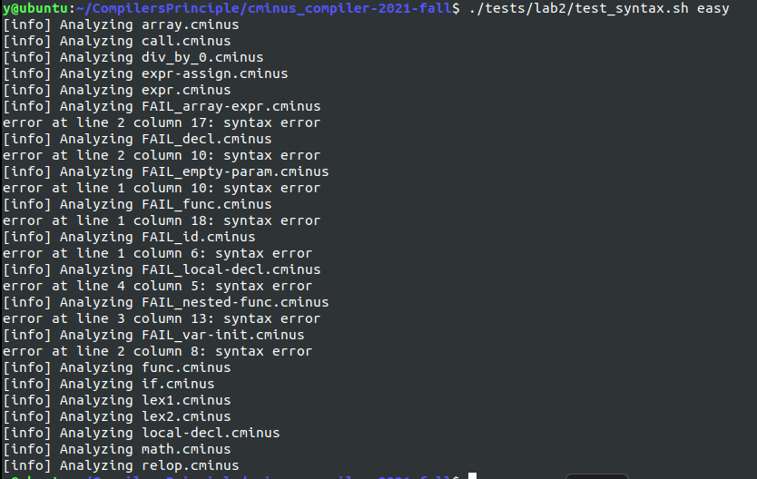
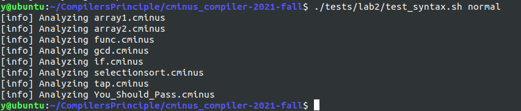
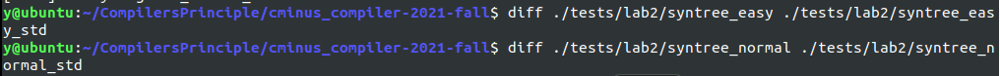
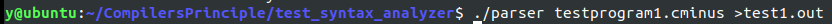
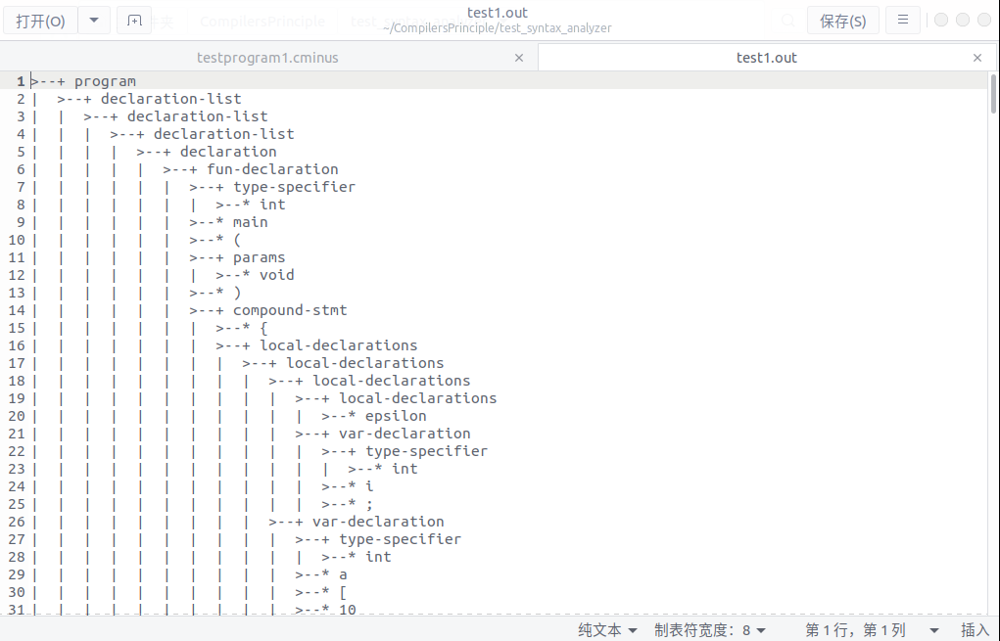
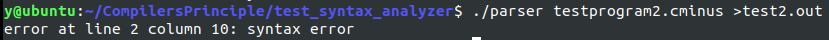

# lab2 实验报告
学号：202004061409 姓名：杨鹏宇
## 实验要求

1.了解Bision基础知识，如何将文法产生式转换为Bison语句

2.阅读/src/common/SyntaxTree.c，对应头文件 /include/SyntaxTree.h，理解分析树生成的过程。

3.了解Bison与Flex的协同工作过程，理解pass_node函数并改写lab1代码。了解yylval工作原理。

4.补全 src/parser/syntax_analyzer.y 文件和lexical_analyzer.l文件

## 实验难点

### 1.Bison的使用

<p style="text-indent:2em">Bison是一个语法分析器的生成工具，用于生成语法分析器。Bison可以将LALR文法转换可编译的c代码。Bison文件的扩展名为.y，在Bison文件中给出LALR文法以及一些分析动作，编译就可以产生一个语法分析器。</p>

<p style="text-indent:2em">Bison文件以.y结尾，与Lex文件的编写规则类似，由%%区分的三部分构成：</p>

```c++
%{
/* 这部分代码会被原样拷贝到生成的 .c 文件的开头 */
#include <stdio.h>
int yylex(void);
void yyerror(const char *s);
%}

/*一些指令，如用%start指定起始符号，%token定义token*/
%start reimu
%token REIMU
    
%%
/*解析规则*/
产生式  {动作代码}

%%
/*辅助函数，会被复制到生成的.c文件的末尾*/
```

<p style="text-indent:2em">Bison需要一个yylex来获取下一个词法单元，还需要一个yyerror提供报错。定义主函数，调用yyparse()，就可以让语法分析器工作。</p>

<p style="text-indent:2em">在语法分析过程中，语法分析树的叶子节点是一个具体的语义值，该值的类型是YYSTYPE，在Bison中用%union指明。不同的节点对应着不同的终结符，可能为不同的类型，因此union中可以包含不同的数据类型。可以指明一个终结符或是非终结符的类型，以便后续的使用。可以使用%type <>或%token <>指明类型。其中%token是在声明词法单元名的同时指明类型，声明的token会由Bison导出到最终的.h文件中，让词法分析器也可以直接使用。</p>

```C++
%token <num> NUMBER		/*声明词法单元名，并在<>中指明类型*/
%type  <typex> expr		/*指明类型*/
...
%union{
    char op;
    double num;
}
```

<p style="text-indent:2em">下面说明语法分析时的动作怎么编写。以一个边进行语法分析边按照语义执行的计算器为例，识别到加法语句的动作为：</p>

```C++
E→E+E	{E=E1+E2}
```

<p style="text-indent:2em">在Bison中的实现：</p>

```C++
term : term ADDOP factor
     {
        switch $2 {
        case '+': $$ = $1 + $3; break;
        case '-': $$ = $1 - $3; break;
        }
     }
```

<p style="text-indent:2em">其中$$表示当前节点，$1,$2,$3表示产生式的成分，也是当前节点的子节点。由于采用自底向上分析(LALR)文法，构建语法树是推导的过程，这些子节点是已经解析的，当前节点则是规约产生的。使用节点union的哪个类型操作，是已经用<>在开头的%token和%type中指明的。</p>

<p style="text-indent:2em">实际的编译器中，语法分析相应的动作通常是建立抽象语法树，进行语义分析，或是直接产生中间或目标代码。在本实验中，动作为自底向上构建语法分析树。</p>

### 2.Bison与Flex的协同工作

<p style="text-indent:2em">Bison需要一个yylex来完成词法分析，这部分的工作是词法分析器完成的。词法分析器不仅要将词素识别为词法单元并返回词法单元值，还要返回词法单元的属性。这是通过yylval完成的。yylval是使用Bison生成的.c文件中声明的一个全局的变量，类型为YYSTYPE，即在Bison文件中%union声明的类型，使用这个类型将属性值传递。进行词法分析时，只要将属性值存入yylval，语法分析器就可以从yylval获取识别到的词法单元的属性值。</p>

<p style="text-indent:2em">在实验中，yylval仅包含一个语法分析树的节点指针。节点中包含一个节点名。对于语法分析树的叶子节点，这个节点名就是词法单元的值，对于非叶子节点，这个节点名为语法成分名。在以下分析语法分析树的生成过程中，分析了节点及分析树是如何构造的。</p>

### 3.分析树的生成过程

<p style="text-indent:2em">分析树的相关数据结构和方法定义在/include/SyntaxTree.h文件中，分析树的节点记录了父节点，子节点的指针，以及子节点数和节点名信息，相关的方法包括生成新的节点，添加子节点，创建语法树等。</p>

```C++
//语法分析树的节点
struct _syntax_tree_node {
	struct _syntax_tree_node * parent;
	struct _syntax_tree_node * children[10];
	int children_num;

	char name[SYNTAX_TREE_NODE_NAME_MAX];
};
typedef struct _syntax_tree_node syntax_tree_node;
//相关函数
syntax_tree_node * new_anon_syntax_tree_node();									//创建新节点
syntax_tree_node * new_syntax_tree_node(const char * name);						
int syntax_tree_add_child(syntax_tree_node * parent, syntax_tree_node * child);	//添加子节点
void del_syntax_tree_node(syntax_tree_node * node, int recursive);				//删除节点
syntax_tree* new_syntax_tree();													//创建语法分析树
void del_syntax_tree(syntax_tree * tree);										//删除分析树
void print_syntax_tree(FILE * fout, syntax_tree * tree);						//输出分析树
```

<p style="text-indent:2em">每个终结符都对应着一个叶子节点，这个叶子节点在词法分析时就可以产生。在自底向上的分析过程中，首先产生的是叶子节点，在用产生式进行规约时向上构建语法分析树。叶子节点的产生在词法分析器中的pass_node()函数中实现，创建一个新的节点，并将其指针赋值给yylval，节点名为其成分(非终结符名或终结符名)，这样语法分析器就可以使用该节点构造语法分析树。</p>

```C++
//生成节点并存入yylval传递给语法分析器
void pass_node(char *text){
     yylval.node = new_syntax_tree_node(text);
}
//识别词法单元时调用pass_node
\+  { pos_start = pos_end; pos_end += 1; pass_node(yytext); return ADD; }
```

<p style="text-indent:2em">词法分析完成了叶子节点的产生，剩下的工作就由语法分析来完成了。构建的过程就是在每使用一个产生式进行规约时，建立一个新的节点表示当前产生式的非终结符，然后将产生式中的成分，也就是子节点的指针存入这个新节点中。当最后使用起始产生式规约时，产生的新节点就是语法分析树的根节点，就完成了向上构建语法分析树的工作。实验在Bison的.y文件中，已经给出了创建新节点并建立节点关系的函数，为node()函数，参数为产生式的非终结符名，产生式成分个数(也即子节点个数)，子节点的指针。</p>

```C++
//产生一个语法分析树新节点的函数
syntax_tree_node *node(const char *node_name, int children_num, ...);
//应用该函数构造语法分析树，根节点的构造
program : declaration-list { $$ = node("program", 1, $1); gt->root = $$; }
```

## 实验设计

### 1.词法分析部分

<p style="text-indent:2em">完善词法分析部分，即./src/parser/lexical_analyzer.l文件。只需要在识别动作中添加pass_node(yytext)产生词法单元叶子节点，通过yylval传递给语法分析器。对于注释，换行符和空格，不需要添加到语法分析树当中，因此创建节点和返回值，如果读到了就更新lines与pos，保证出错时可以定位，然后进行下一个词法单元的识别就可以了。</p>

```C++
%%

\+  { pos_start = pos_end; pos_end += 1; pass_node(yytext); return ADD; }
\-   {pos_start = pos_end; pos_end++; pass_node(yytext); return SUB;}
\*   {pos_start = pos_end; pos_end++; pass_node(yytext); return MUL;}
\/   {pos_start = pos_end; pos_end++; pass_node(yytext); return DIV;}
\<   {pos_start = pos_end; pos_end++; pass_node(yytext); return LT;}
"<=" {pos_start = pos_end; pos_end+=2; pass_node(yytext); return LTE;}
\>   {pos_start = pos_end; pos_end++; pass_node(yytext); return GT;}
">=" {pos_start = pos_end; pos_end+=2; pass_node(yytext); return GTE;}
"==" {pos_start = pos_end; pos_end+=2; pass_node(yytext); return EQ;}	
"!=" {pos_start = pos_end; pos_end+=2; pass_node(yytext); return NEQ;}
\=   {pos_start = pos_end; pos_end++; pass_node(yytext); return ASSIN;}
\;   {pos_start = pos_end; pos_end++; pass_node(yytext); return SEMICOLON;}
\,   {pos_start = pos_end; pos_end++; pass_node(yytext); return COMMA;}
\(  {pos_start = pos_end; pos_end++; pass_node(yytext); return LPARENTHESE;}
\)  {pos_start = pos_end; pos_end++; pass_node(yytext); return RPARENTHESE;}
\[  {pos_start = pos_end; pos_end++; pass_node(yytext); return LBRACKET;}
\]  {pos_start = pos_end; pos_end++; pass_node(yytext); return RBRACKET;}
\{  {pos_start = pos_end; pos_end++; pass_node(yytext); return LBRACE;}
\}  {pos_start = pos_end; pos_end++; pass_node(yytext); return RBRACE;}
else {pos_start = pos_end; pos_end+=4; pass_node(yytext); return ELSE;}
if   {pos_start = pos_end; pos_end+=2; pass_node(yytext); return IF;}
int  {pos_start = pos_end; pos_end+=3; pass_node(yytext); return INT;}
float {pos_start = pos_end; pos_end+=5; pass_node(yytext); return FLOAT;}
return {pos_start = pos_end; pos_end+=6; pass_node(yytext); return RETURN;}
void   {pos_start = pos_end; pos_end+=4; pass_node(yytext); return VOID;}
while  {pos_start = pos_end; pos_end+=5; pass_node(yytext); return WHILE;}
[a-zA-Z]+ {pos_start = pos_end; pos_end+=strlen(yytext); pass_node(yytext); return IDENTIFIER;}
[a-zA-Z]  {pos_start = pos_end; pos_end++; pass_node(yytext); return LETTER;}  
[0-9]+    {pos_start = pos_end; pos_end+=strlen(yytext); pass_node(yytext); return INTEGER;}
[0-9]+\.|[0-9]*\.[0-9]+ {pos_start = pos_end; pos_end+=strlen(yytext); pass_node(yytext); return FLOATPOINT;}
"[]" {pos_start = pos_end; pos_end+=2; pass_node(yytext); return ARRAY;}
\n  {lines++;pos_end = 1;} 
"/*"([^*]|\*+[^*/])*\*+"/"  {
    for(int i=0;i<strlen(yytext);i++){
        if(yytext[i]=='\n') {
            lines++;
            pos_end = 1;	//pos_start由pos_end得到，这里就不需要置1了
        }
        else pos_end++;
    }
}
[" "|\t] {pos_start = pos_end; pos_end+=strlen(yytext);}
. {pos_start = pos_end; pos_end+=strlen(yytext);printf("lexical analyze error at line %d pos %d\n",lines,pos_start);}

%%
```

### 2.语法分析部分

<p style="text-indent:2em">完善词法分析部分，即./src/parser/lexical_analyzer.l文件。首先完成yylval的定义，在union中只含有一个节点指针。</p>

```c++
%union {
    syntax_tree_node *node;
}
```

<p style="text-indent:2em">接下来进行终结符(词法单元)的声明和非终结符的类型声明，类型都是语法分析树的节点指针，其中终结符名要和词法分析部分中的token一致，非终结符名和Cminus-f的语法规则中一致。声明如下：</p>

```C++
%start program
%token <node> ADD SUB MUL DIV
%token <node> LT LTE GT GTE EQ NEQ ASSIN
%token <node> SEMICOLON COMMA LPARENTHESE RPARENTHESE LBRACKET RBRACKET LBRACE RBRACE
%token <node> ELSE IF INT FLOAT RETURN VOID WHILE IDENTIFIER LETTER INTEGER FLOATPOINT ARRAY
%type <node> type-specifier relop addop mulop
%type <node> declaration-list declaration var-declaration fun-declaration local-declarations
%type <node> compound-stmt statement-list statement expression-stmt iteration-stmt selection-stmt return-stmt
%type <node> simple-expression expression var additive-expression term factor integer float call
%type <node> params param-list param args arg-list program
```

<p style="text-indent:2em">最后补充语法规则的部分，规则按照给出的Cminus-f的语法编写，动作则是调用node()函数构造语法分析树的节点，参数为子节点个数和使用$n表示的子节点的指针，当产生式为空输入时，参数为0，子节点为空串。</p>

```C++
program : declaration-list { $$ = node("program", 1, $1); gt->root = $$; } ;
declaration-list : declaration-list declaration { $$ = node("declaration-list", 2, $1, $2); }
                 | declaration { $$ = node("declaration-list", 1, $1); }
                 ;
declaration : var-declaration { $$ = node("declaration", 1, $1); }
            | fun-declaration { $$ = node("declaration", 1, $1); }
            ;
var-declaration : type-specifier IDENTIFIER SEMICOLON { $$ = node("var-declaration", 3, $1, $2, $3); }
                | type-specifier IDENTIFIER LBRACKET INTEGER RBRACKET SEMICOLON { $$ = node("var-declaration", 6, $1, $2, $3, $4, $5, $6); }
                ;
type-specifier : INT { $$ = node("type-specifier", 1, $1); }
               | FLOAT { $$ = node("type-specifier", 1, $1); }
               | VOID { $$ = node("type-specifier", 1, $1); }
               ;
fun-declaration : type-specifier IDENTIFIER LPARENTHESE params RPARENTHESE compound-stmt { $$ = node("fun-declaration", 6, $1, $2, $3, $4, $5, $6); } ;
params : param-list { $$ = node("params", 1, $1); }
       | VOID { $$ = node("params", 1, $1); }
       ;
param-list : param-list COMMA param { $$ = node("param-list", 3, $1, $2, $3); }
           | param { $$ = node("param-list", 1, $1); }
           ;
param : type-specifier IDENTIFIER { $$ = node("param", 2, $1, $2); }
      | type-specifier IDENTIFIER ARRAY { $$ = node("param", 3, $1, $2, $3); }
      ;
compound-stmt : LBRACE local-declarations statement-list RBRACE { $$ = node("compound-stmt", 4, $1, $2, $3, $4); } ;
local-declarations : { $$ = node("local-declarations", 0); }
                   | local-declarations var-declaration { $$ = node("local-declarations", 2, $1, $2); }
                   ;
statement-list : { $$ = node("statement-list", 0); }
               | statement-list statement { $$ = node("statement-list", 2, $1, $2); }
               ;
statement : expression-stmt { $$ = node("statement", 1, $1); }
          | compound-stmt { $$ = node("statement", 1, $1); }
          | selection-stmt { $$ = node("statement", 1, $1); }
          | iteration-stmt { $$ = node("statement", 1, $1); }
          | return-stmt { $$ = node("statement", 1, $1); }
          ;
expression-stmt : expression SEMICOLON { $$ = node("expression-stmt", 2, $1, $2); }
                | SEMICOLON { $$ = node("expression-stmt", 1, $1); }
                ;
selection-stmt : IF LPARENTHESE expression RPARENTHESE statement { $$ = node("selection-stmt", 5, $1, $2, $3, $4, $5); }
               | IF LPARENTHESE expression RPARENTHESE statement ELSE statement { $$ = node("selection-stmt", 7, $1, $2, $3, $4, $5, $6, $7); }
               ;
iteration-stmt : WHILE LPARENTHESE expression RPARENTHESE statement { $$ = node("iteration-stmt", 5, $1, $2, $3, $4, $5); } ;
return-stmt : RETURN SEMICOLON { $$ = node("return-stmt", 2, $1, $2); }
            | RETURN expression SEMICOLON { $$ = node("return-stmt", 3, $1, $2, $3); }
            ;
expression : var ASSIN expression { $$ = node("expression", 3, $1, $2, $3); }
           | simple-expression { $$ = node("expression", 1, $1); }
           ;
var : IDENTIFIER { $$ = node("var", 1, $1); }
    | IDENTIFIER LBRACKET expression RBRACKET { $$ = node("var", 4, $1, $2, $3, $4); }
    ;
simple-expression : additive-expression relop additive-expression { $$ = node("simple-expression", 3, $1, $2, $3); }
                  | additive-expression { $$ = node("simple-expression", 1, $1); }
                  ;
relop : LTE { $$ = node("relop", 1, $1); }
      | LT { $$ = node("relop", 1, $1); }
      | GT { $$ = node("relop", 1, $1); }
      | GTE { $$ = node("relop", 1, $1); }
      | EQ { $$ = node("relop", 1, $1); }
      | NEQ { $$ = node("relop", 1, $1); }
      ;
additive-expression : additive-expression addop term { $$ = node("additive-expression", 3, $1, $2, $3); }
                    | term { $$ = node("additive-expression", 1, $1); }
                    ;
addop : ADD { $$ = node("addop", 1, $1); }
      | SUB { $$ = node("addop", 1, $1); }
      ;
term : term mulop factor { $$ = node("term", 3, $1, $2, $3); }
     | factor { $$ = node("term", 1, $1); }
     ;
mulop : MUL { $$ = node("mulop", 1, $1); }
      | DIV { $$ = node("mulop", 1, $1); }
      ;
factor : LPARENTHESE expression RPARENTHESE { $$ = node("factor", 3, $1, $2, $3); }
       | var { $$ = node("factor", 1, $1); }
       | call { $$ = node("factor", 1, $1); }
       | integer { $$ = node("factor", 1, $1); }
       | float { $$ = node("factor", 1, $1); }
       ;
integer : INTEGER { $$ = node("integer", 1, $1); } ;
float : FLOATPOINT { $$ = node("float", 1, $1); } ;
call : IDENTIFIER LPARENTHESE args RPARENTHESE { $$ = node("call", 4, $1, $2, $3, $4); } ;
args : { $$ = node("args", 0); }
     | arg-list { $$ = node("args", 1, $1); }
     ;
arg-list : arg-list COMMA expression { $$ = node("arg-list", 3, $1, $2, $3); }
         | expression { $$ = node("arg-list", 1, $1); }
         ;
```

<p style="text-indent:2em">完成了以上的补充后，语法分析和词法分析就应该都可以正常进行了。尝试编译时提示缺少yyin的声明，在语法分析函数parse中使用了yyin来进行读入，yyin是词法分析Flex产生的变量，这里需要引入，因此在开头补充引入该文件指针变量。</p>

```C++
extern FILE *yyin;
```

## 实验结果验证

### 1.给出的测试样例

<p style="text-indent:2em">编译成功后执行命令./tests/lab2/test_syntax.sh easy和./tests/lab2/test_syntax.sh normal生成语法分析树。</p>





<p style="text-indent:2em">diff命令验证结果是否正确。</p>



### 2.自行编写的测试样例

<p style="text-indent:2em">编写一个cminus-f程序进行语法分析，产生语法分析树。</p>

```C++
int main(void){
    int i;int a[10];int j;
    i=0;j=10;
    quicksort(a,i,j);
    return 0;
}
void quicksort(int a[],int l, int r){
    int p;
    if(l<r){
        p = partition(a,l,r);
        quicksort(a,l,p-1);
        quicksort(a,l,p+1);
    }
}
int partition(int a[],int l,int r){
    int temp;
    temp = a[l];
    while(l<r){
        while(temp<=a[r]){
            r = r-1;
            if(l==r){
                a[l] = temp;
                return l;
            }
        }
        a[l] = a[r];
        while(temp>=a[l]){
            l = l+1;
            if(l==r){
                a[l] = temp;
                return l;
            }
        }
    }
}
```

<p style="text-indent:2em">没有语法错误，相应的语法分析树也是正确的。部分结果如下：</p>





<p style="text-indent:2em">编写一个存在语法错误的程序，cminus语法中变量不可以在一个声明语句声明多个同类型变量。</p>

```C++
int func(int a[], int n){
	int i,sum;
    i = n;
    sum = 0;
    while(i>0){
        sum = sum+a[i];
        i--;
    }
    return ;
}
```

<p style="text-indent:2em">程序给出了语法错误的位置。</p>



## 实验反馈

<p style="text-indent:2em">通过实验学习了Bison的使用，学习了Bison和Flex协同工作的工作原理和实现方法。加深了对语法分析部分和语法制导翻译部分内容的理解。熟悉了编译器前端的工作过程。</p>
