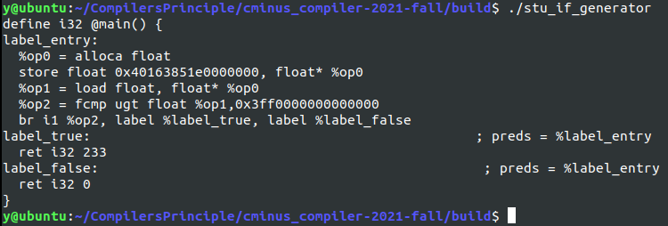

# lab3 实验报告
学号：202004061409 姓名：杨鹏宇

## 问题1: cpp与.ll的对应
请描述你的cpp代码片段和.ll的每个BasicBlock的对应关系。描述中请附上两者代码。

### assign

<p style="text-indent:2em">对应的.ll代码如下：</p>

```ll
define i32 @main() #0 {
    %1 = alloca [10 x i32]    ;int a[10]
    %2 = getelementptr inbounds [10 x i32], [10 x i32]* %1, i32 0, i32 0        ;a[0] addr    
    %3 = getelementptr inbounds [10 x i32], [10 x i32]* %1, i32 0, i32 1        ;a[1] addr
    store i32 10, i32* %2     ;a[0] = 10
    %4 = load i32, i32* %2    ;%4 = a[0]
    %5 = mul i32 %4,2         ;%5 = a[0]*2
    store i32 %5, i32* %3     ;a[1] = %5 = a[0]*2
    %6 = load i32, i32* %3    ;%6 = a[1]
    ret i32 %6                ;return a[1]
}
```

<p style="text-indent:2em">这一段程序仅有一个函数，一个BasicBlock。仿照gcd_array.cpp的写法，创建Module和BasicBlock，将.ll中的指令使用IRBuilder插入到BasicBlock的指令链表当中。与.ll中指令的对应关系在以下的cpp代码片段的注释中说明。cpp
代码片段如下：</p>

```C++
#include "BasicBlock.h"
#include "Constant.h"
#include "Function.h"
#include "IRBuilder.h"
#include "Module.h"
#include "Type.h"
#include <iostream>
#include <memory>

#ifdef DEBUG  // 用于调试信息,大家可以在编译过程中通过" -DDEBUG"来开启这一选项
#define DEBUG_OUTPUT std::cout << __LINE__ << std::endl;  // 输出行号的简单示例
#else
#define DEBUG_OUTPUT
#endif

#define CONST_INT(num) \
    ConstantInt::get(num, module)

#define CONST_FP(num) \
    ConstantFP::get(num, module) // 得到常数值的表示,方便后面多次用到

int main() {
    auto module = new Module("Assign");                 
    auto builder = new IRBuilder(nullptr, module);                      //使用IRBuilder创建指令
    //创建函数与BasicBlock
    Type *Int32Type = Type::get_int32_type(module);
    auto mainTy = FunctionType::get(Int32Type, {});                     //返回值为i32，参数为空
    auto main = Function::create(mainTy, "main", module);            
    auto BB = BasicBlock::create(module, "BasicBlock1" , main);
    builder->set_insert_point(BB);                                      //设置插入指令的BasicBlock
    //插入.ll中对应的指令
    auto *arrayType = ArrayType::get(Int32Type, 10);                    //数组的类型为[10 x i32]
    auto a = builder->create_alloca(arrayType);                         //分配数组
    auto a0P = builder->create_gep(a, {CONST_INT(0), CONST_INT(0)});    //计算a[0]地址
    auto a1P = builder->create_gep(a, {CONST_INT(0), CONST_INT(0)});    //计算a[1]地址
    builder->create_store({CONST_INT(10)}, a0P);                        //a[0] = 10
    auto a0 = builder->create_load(a0P);                                //取出a[0]
    auto temp = builder->create_imul(a0, {CONST_INT(2)});               //a[0]*2
    builder->create_store(temp, a1P);                                   //a1 = a[0]*2
    auto a1 = builder->create_load(a1P);       
    builder->create_ret(a1);                                            //return a1 = a[0]*2
    //指令创建结束
    std::cout << module->print();
    delete module;
    return 0;
}
```

<p style="text-indent:2em">make之后运行程序进行验证，生成的指令和.ll中的指令相同。</p>


### fun

<p style="text-indent:2em">对应的.ll代码如下：</p>

```ll
define i32 @callee(i32 %0) #0 {
    %2 = mul i32 %0, 2               ;%2 = a*2
    ret i32 %2
}
define i32 @main() #0 {
    %1 = call i32 @callee(i32 110)   ;%1 = callee(110)
    ret i32 %1                       ;return
}
```

<p style="text-indent:2em">共有两个函数，相应有两个BasicBlock，分别插入指令。与.ll中指令的对应关系在注释中说明，相应的cpp代码如下：</p>

```c++
//头文件和宏定义省略
int main(){
    auto module = new Module("fun");
    auto builder = new IRBuilder(nullptr, module);
    //创建callee函数
    Type *Int32Type = Type::get_int32_type(module);
    auto calleeTy = FunctionType::get(Int32Type, {Int32Type});            //返回值为i32，一个i32类型的参数
    auto callee = Function::create(calleeTy, "callee", module); 
    auto BB = BasicBlock::create(module, "callee_BasicBlock" , callee);
    builder->set_insert_point(BB);
    //插入callee的BasicBlock中的指令
    std::vector<Value *> args;                                            //获取函数的形参,通过Function中的iterator
    for (auto arg = callee->arg_begin(); arg != callee->arg_end(); arg++) {
        args.push_back(*arg);                                             //* 号运算符是从迭代器中取出迭代器当前指向的元素
    }
    auto mul = builder->create_imul(args[0], CONST_INT(2));             //mul = a*2
    builder->create_ret(mul);
    //创建main函数
    auto mainTy = FunctionType::get(Int32Type, {});
    auto main = Function::create(mainTy, "main", module); 
    auto BB1 = BasicBlock::create(module, "main_BasicBlock" , main);
    builder->set_insert_point(BB1);
    //插入main的BasicBlock中的指令
    auto callret = builder->create_call(callee, {CONST_INT(110)});       //callret = callee(110)
    builder->create_ret(callret);                                        //return callret
    //指令创建结束
    std::cout << module->print();
    delete module;
    return 0;
}
```

<p style="text-indent:2em">运行程序，生成的指令和.ll中的指令相同。</p>


### if

<p style="text-indent:2em">对应的.ll代码如下：</p>

```ll
define i32 @main() #0 {
    %1 = alloca float                    ;%1 = float a addr
    store float 0x40163851E0000000, float* %1
    %2 = load float, float* %1           ;%2 = a
    %3 = fcmp ugt float %2, 1.0          ;a>1   
    br i1 %3, label %4, label %5         ;if(a>1) goto 4 else goto 5
4:
    ret i32 233
5:
    ret i32 0
}
```

<p style="text-indent:2em">本段指令有3个BasicBlock，相比与前两个多了fcmp和br跳转指令。相应的.cpp文件如下：</p>

```c++
//头文件和宏定义省略
int main(){
    auto module = new Module("if");                 
    auto builder = new IRBuilder(nullptr, module);                      //使用IRBuilder创建指令
    //创建main函数
    Type *Int32Type = Type::get_int32_type(module);
    auto mainTy = FunctionType::get(Int32Type, {});                     //返回值为i32，参数为空
    auto main = Function::create(mainTy, "main", module);
    auto BBEntry = BasicBlock::create(module, "entry" , main);
    builder->set_insert_point(BBEntry); 
    //entryBasicBlock插入指令，对应.ll的BasicBlock0
    Type *FloatType = Type::get_float_type(module);                     //浮点类型
    auto aP = builder->create_alloca(FloatType);                        //为float a分配空间并返回指针
    builder->create_store(CONST_FP(5.555),aP);                          //a = 5.555
    auto a = builder->create_load(aP);                                  //取出a
    auto fcmp = builder->create_fcmp_gt(a, CONST_FP(1.0));              //fcmp = if a>1
    //创建true, false对应的BasicBlock
    auto BBTrue = BasicBlock::create(module, "true" , main);
    auto BBFalse = BasicBlock::create(module, "false", main);
    builder->create_cond_br(fcmp, BBTrue, BBFalse);                     //br跳转指令
    //true和false对应的BasicBlock插入指令，对应.ll的BasicBlock4,5
    builder->set_insert_point(BBTrue);
    builder->create_ret(CONST_INT(233));
    builder->set_insert_point(BBFalse);
    builder->create_ret(CONST_INT(0));
    //指令创建结束
    std::cout << module->print();
    delete module;
    return 0;
}
```

<p style="text-indent:2em">运行程序验证：</p>



### while

<p style="text-indent:2em">对应的.ll代码如下：</p>

```ll
define i32 @main() #0 {
    %1 = alloca i32        ;%1 = a addr
    %2 = alloca i32        ;%2 = i addr
    store i32 0, i32* %2   ;i = 0
    store i32 10, i32* %1  ;a = 10
    br label %3             

;if i<10
3:
    %4 = load i32, i32* %2        ;%4 = i
    %5 = icmp slt i32 %4, 10      ;i < 10?
    br i1 %5, label %6, label %10
    
6:
    %7 = add nsw i32 %4, 1        ;i + 1
    store i32 %7, i32* %2         ;i = i + 1
    %8 = load i32, i32* %1        ;%8 = a
    %9 = add nsw i32 %7, %8       ;%9 = a + i
    store i32 %9, i32* %1         ;a = a + i
    br label %3
    
10:
    ret i32 %9                    ;return a
}
```

<p style="text-indent:2em">以上的.ll程序共有四个BasicBlock，逐个添加指令即可。.cpp中的BasicBlock与.ll的对应在注释中说明。.cpp的代码如下：</p>

```c++
int main(){
    auto module = new Module("while");                 
    auto builder = new IRBuilder(nullptr, module);                      //使用IRBuilder创建指令
    //创建main函数和4个BasicBlock
    Type *Int32Type = Type::get_int32_type(module);
    auto mainTy = FunctionType::get(Int32Type, {});                     //返回值为i32，参数为空
    auto main = Function::create(mainTy, "main", module);
    auto BBEntry = BasicBlock::create(module, "entry" , main);
    auto BBWhile = BasicBlock::create(module, "while" , main);
    auto BBTrue = BasicBlock::create(module, "true" , main);
    auto BBFalse = BasicBlock::create(module, "false" , main);
    //entryBasicBlock插入指令，即.ll的BasicBlock0
    builder->set_insert_point(BBEntry);
    auto aP = builder->create_alloca(Int32Type);                        //分配a的空间，返回指针aP
    auto iP = builder->create_alloca(Int32Type);                        //分配i的空间，返回指针iP
    builder->create_store(CONST_INT(0), iP);                            //i = 0
    builder->create_store(CONST_INT(10), aP);                           //a = 10
    builder->create_br(BBWhile);                                        //br跳转到while循环的判断BasicBlock
    //whileBasicBlock插入指令，即.ll的BasicBlock3
    builder->set_insert_point(BBWhile);
    auto temp = builder->create_load(iP);
    auto icmp = builder->create_icmp_lt(temp, CONST_INT(10));
    builder->create_cond_br(icmp, BBTrue, BBFalse);                     //br跳转到True或False的BasicBlock
    //TrueBasicBlock插入指令，即.ll的BasicBlock6
    builder->set_insert_point(BBTrue);
    auto newi = builder->create_iadd(temp, CONST_INT(1));               //i + 1
    builder->create_store(newi, iP);                                    //i = i + 1
    auto a = builder->create_load(aP);
    auto newa = builder->create_iadd(newi, a);                          //a + i
    builder->create_store(newa, aP);                                    //a = a + i
    builder->create_br(BBWhile);                                        //br跳转到while循环的判断BasicBlock
    //FalseBasicBlock插入指令，即.ll的BasicBlock10
    builder->set_insert_point(BBFalse);
    builder->create_ret(newa);                                          //return a
    //指令创建结束
    std::cout << module->print();
    delete module;
    return 0;
}
```

<p style="text-indent:2em">运行程序验证：</p>


<p style="text-indent:2em">以上的.ll代码和.cpp编译运行后的.ll代码运行后均能产生正确的结果，与原.c程序的逻辑相同.</p>

## 问题2: Visitor Pattern

请指出visitor.cpp中，`treeVisitor.visit(exprRoot)`执行时，以下几个Node的遍历序列:numberA、numberB、exprC、exprD、exprE、numberF、exprRoot。  
序列请按如下格式指明：  
exprRoot->numberF->exprE->numberA->exprD

<p style="text-indent:2em">根据visitor.cpp中的内容，每个节点会返回自身的引用，visitor会进行访问该节点，计算该节点的值，计算的方式是访问其左右节点并获取值，然后根据节点的操作类型完成值的计算，然后返回。子节点的值的获取也是相同的，直到访问到数值节点，就直接返回相应的数值。可以看出访问的过程是自顶向下递归访问的过程。main函数中创建的计算树如下：</p>


<p style="text-indent:2em">根据visit()函数中的实现，对于AddSubNode的访问，是先访问右子节点，然后访问左子节点，对于MulDivNode的访问，先访问左子节点，后访问右子节点。因此可以得出visitor.cpp中访问该树的序列为：</p>

<p style="text-indent:2em">exprRoot->numberF->exprE->exprD->numberB->numberA->exprC->numberA->numberB</p>

## 问题3: getelementptr

请给出`IR.md`中提到的两种getelementptr用法的区别,并稍加解释:
  - `%2 = getelementptr [10 x i32], [10 x i32]* %1, i32 0, i32 %0` 
  - `%2 = getelementptr i32, i32* %1 i32 %0` 

第一种用法：

<p style="text-indent:2em">指针类型为[10 x i32]*，指向的数据类型为[10 x i32]，因此首先用i32 0表示偏移为0，这表示直接取第一个[10 x i32]数组，然后的i32 %0表示在第一个[10 x i32]数组内，偏移%0的元素地址。</p>

第二种用法：

<p style="text-indent:2em">指针类型为i32*，%1表示的是数组的起始地址，偏移量为%0，直接取出了数组偏移%0位置的元素地址。</p>

区别：

<p style="text-indent:2em">在第一种用法中，指针类似于指针数组，首先确定在这个指针数组上的偏移，才能得到一个数组的指针，然后通过偏移找到元素的地址。而在第二种用法中，直接对数组的指针进行偏移，找到元素的地址。</p>

<p style="text-indent:2em">当定义全局数组或结构体时，定义的是指针，例如在给出的gcd_array.c中声明的全局数组x，y，就是[1 x i32]*类型，因此取出元素时使用的是第一种用法。</p>

```c
//全局数组x[1]
@x = common dso_local global [1 x i32] zeroinitializer, align 4
//取出元素地址
getelementptr inbounds ([1 x i32], [1 x i32]* @x, i64 0, i64 0)
```

## 实验难点

### 1.编写.ll

<p style="text-indent:2em">在编写if.c对应的.ll时，提示error: floating point constant invalid for type，不能用浮点常量给浮点数赋值。经查询，这是因为浮点数5.55不能用浮点数精确表示，因此不能直接给浮点数赋值。如果是4.0等可以精确表示的数，就可以直接赋值。此处只能使用十六进制的浮点数机器表示进行赋值，为0x40163851E0000000。</p>

<p style="text-indent:2em">编写while.c对应的.ll时注意到，编号顺序必须是连续的，除了if对应的块跳转语句可以出现不连续的编号，其他编号都必须是连续的。因此br语句中的跳转编号应该最后填写。</p>

<p style="text-indent:2em">编写.ll后，与.c源文件产生的.ll文件进行了比较，clang产生的.ll文件中的指令更多，对于值进行了更多的存储和取出的操作，但是逻辑上是和自行编写的.ll指令是相同的。自行编写时，临时变量直接使用寄存器存储，还有一些寄存器值也重复使用，相当于对直接产生的.ll指令优化后的结果。</p>

### 2.编写cpp

<p style="text-indent:2em">编写cpp时，由于对接口不熟悉，创建对应的指令有些困难，在经过阅读gcd_array.cpp中创建指令的部分和整体结构，仿照并逐个指令完成assign.cpp后，后三个cpp代码的编写才比较顺利。</p>

<p style="text-indent:2em">创建比较指令时，指令名使用了lightIR中的ugt来表示小于，编译时提示不存在这条指令，从lightIR.h中找到，比较的指令使用的是下面的表示：</p>

```c++
public:
    enum CmpOp
    {
        EQ, // ==
        NE, // !=
        GT, // >
        GE, // >=
        LT, // <
        LE  // <=
    };
```

<p style="text-indent:2em">因此修改相应的比较指令为以下形式：</p>

```c++
auto fcmp = builder->create_fcmp_gt(a, CONST_FP(1.0)); 
auto icmp = builder->create_icmp_lt(temp, CONST_INT(10));
```

## 实验反馈

<p style="text-indent:2em">通过本次实验学习了llvm，LightIR相关知识。对于LightIR的接口，文档内容没有特别清晰，通过结合实例和.h文件中的内容才逐渐熟悉。编写.ll文件时，注意到了与clang编译代码的不同，自行编写可以在许多位置直接进行优化，而编译器可能第一步只能生成未优化的代码。对于自行编写的.ll指令，使用C++生成的过程也相对较为简洁。最后通过visitor.cpp了解了访问者模式，对于这种模式比较陌生，但是通过实例理解了其工作原理和访问过程。</p>

