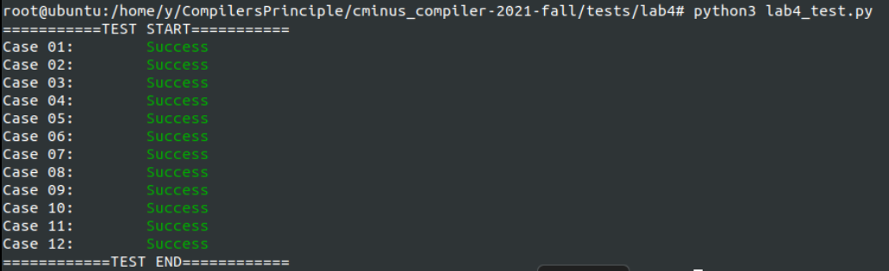

# Lab4 实验报告

姓名：杨鹏宇 学号：202004061409

## 实验要求

<p style="text-indent:2em">cminus-f的词法分析和语法分析部分已经完成，最终得到的是语法分析树。而为了产生目标代码，还需要将语法分析树转为抽象语法树，通过抽象语法分析树生成中间代码(即IR)，最后使用中间代码来进行优化并生成目标代码。在本实验中，只要完成中间表示IR的生成，语法分析树到抽象语法树的转换已经在框架中提供了，而IR代码到目标代码的生成由clang来完成。</p>

<p style="text-indent:2em">生成IR指令的过程为在访问者模式下访问抽象语法树。本次实验要完成的就是访问抽象语法树的相关visit函数，在这些visit函数中要完成IR指令的生成。</p>

## 实验难点

### 1.使用AST和visit函数生成IR指令

<p style="text-indent:2em">由于cminus-f的语法还是比lab3中计算器要复杂的多，供参考的抽象语法树的打印代码也还是和生成IR指令由很大差别，在开始编写时存在困难。通过阅读AST的头文件和lab3的visitor.cpp，首先确定了visit函数生成IR指令的过程：</p>

- visit函数调用当前节点的子节点accept函数，即调用子节点的visit函数
- 处理当前节点，生成指令

<p style="text-indent:2em">若子节点需要向父节点传值，则通过全局变量来实现。在visit节点时还要加入语义分析的部分，判断语义是否正确。</p>

<p style="text-indent:2em">为了进一步弄清楚遍历AST生成IR的过程，在各个visit函数中加入logging信息，也为后续排查错误做好准备。然后首先完成较为简单的表达式处理等部分，通过这个过程逐渐熟悉IR转换和层次关系以及传值的过程，最后完成困难的visit函数。并在实现过程中逐步用简单的cminus程序测试，用logging找到出错的位置，完成逐个函数的设计。</p>

<p style="text-indent:2em">以第一个产生式program->declaration-list为例，首先找到节点的定义，program节点包含一个保存了declaration的vector，因此在visit中要逐个调用这些declaration节点的accept函数。Program只需要产生声明，不需要产生IR，只需要进行语义分析，在语义说明中给出了以下规则：</p>

- 一个程序由一系列声明组成，声明包括了函数声明与变量声明，它们可以以任意顺序排列。
- 一个程序中至少要有一个声明且最后一个声明必须是 void main(void)形式的函数声明。

<p style="text-indent:2em">只需要对第二条进行检查，判断至少有一个声明，且最后一个声明是否是void main(void)形式的函数声明。在Declaration类型的节点中有id和type，进行检查即可，其中type是CminusType类型，在hpp开头枚举。因此Program节点的visit函数如下：</p>

```c++
void CminusfBuilder::visit(ASTProgram &node) { 
    LOG(DEBUG) << "Program\n";
    //语义检查
    if(node.declarations.size()==0){
        cout << "ERROR: 该程序中没有声明。\n";
        return;
    }
    if(!(node.declarations.back()->id=="main"&& node.declarations.back()->type==TYPE_VOID)){
        cout << "ERROR: 最后一个声明不是void main(void)";
        return;
    }
    //访问declarations子节点
    for(auto dec: node.declarations)
        dec->accept(*this);
    return;
}
```

### 2.函数参数的处理

<p style="text-indent:2em">在编写FunDeclaration和Param的visit函数时，不明确参数具体的处理方法。找到lab3中由clang生成的.ll，对于参数的处理都是先分配空间，然后使用store指令将参数值存入分配好的空间。例如以下程序：</p>

```c++
define i32 @callee(i32 %0) #0 {
    %2 = alloca i32
    store i32 %0, i32* %2
	...
}
```

<p style="text-indent:2em">但是Param的参数只有id，表示的是源程序中的参数名，对于如何找到这个参数产生了疑惑。重新找到lab3中编写的cpp传参的部分，传参是在函数创建以后，通过Function中的iterator获取得到的。</p>

```c++
    //插入callee的BasicBlock中的指令
    std::vector<Value *> args;                      //获取函数的形参,通过Function中的iterator
    for (auto arg = callee->arg_begin(); arg != callee->arg_end(); arg++) {
        args.push_back(*arg);                       //* 号运算符是从迭代器中取出迭代器当前指向的元素
    }
    auto mul = builder->create_imul(args[0], CONST_INT(110));             //mul = a*2
```

<p style="text-indent:2em">此处获取参数的部分，是直接按lab3提供的gcd_array.cpp仿照编写的，因为理解不够深入，所以在本实验处理参数时又产生了疑惑。回顾lab3此部分代码后，FunDeclaration中的参数存储的部分就没有问题了。与lab3不同的是，FunDeclaration是逐个调用Param的accept函数，完成存储空间分配的，所以需要一个全局变量在FunDeclaration和Param的visit函数之间传递arg。</p>

### 3.ASTVar的处理

<p style="text-indent:2em">根据cminus的语义说明，Var可以是整型变量，浮点变量或数组变量。如果是数组变量，需要判断下标是否为负，如果为负则添加neg_idx_except指令退出程序，否则计算对应元素的地址(gep指令)。如果是数组，则下标可能是个表达式，需要确保表达式的返回结果为整型，然后才能进行取元素的操作。</p>

<p style="text-indent:2em">从上面的语义说明可以理解Var是一种变量。但是下面的赋值语义说明：先找到var代表的变量地址（如果是数组，需要先对下标表达式求值），然后对右侧的表达式进行求值，求值结果将在转换成变量类型后存储在先前找到的地址中。同时，存储在var中的值将作为赋值表达式的求值结果。一开始结合Var节点中含有一个表达式，把这句话错误的理解为了在Var的visit函数内要完成找到地址，求表达式的值并赋值的指令。后来为了进一步理解Var变量的visit函数内要产生什么指令，继续阅读了剩下的产生式，最终找到Var出现的两种情况：</p>

- expression→var = expression | simple-expression
- factor→(expression) | var | call | integer | float

<p style="text-indent:2em">这两种情况下对于var的处理是不同的。对于第一种情况，var是赋值表达式的一个组成部分，在访问赋值表达式时，应该访问Var，在全局变量ret中保存Var的地址，然后进行赋值，产生store指令；而第二种情况，应该将Var的值取出保存到ret中，作为因子参与计算表达式的计算。因此访问Var节点时，需要知道是从哪种情况访问的，为此添加一个全局变量ifAssign，如果访问赋值语句，就将该变量置为true，访问Var时返回地址。</p>

<p style="text-indent:2em">解决了以上问题后，就可以根据是否有指向expression的指针判断是否为数组，然后取出相应的值或者地址了。如果是数组，还要对下标进行处理。如果下标为负则终止程序，这可以通过跳转到一个仅含终止指令的exitBasicBlock实现。</p>

```c++
auto ifNegative = builder->create_icmp_lt(idx, CONST_INT(0));
//创建exitBasicBlock和正常继续的BasicBlock
auto exitBB = BasicBlock::create(module.get(), node.id + "exit", func);
auto nextBB = BasicBlock::create(module.get(), node.id + "next", func);
//条件跳转指令
builder->create_cond_br(ifNegative, exitBB, nextBB);
```

<p style="text-indent:2em">处理非数组变量比较简单，处理数组变量时又产生了问题，因为数组获取元素地址有两种方式，即lab3中的两种getelementptr，分别需要两个偏移和一个偏移。为了明确如何处理数组，得到数组元素的指针，重新比较两种数组的分配的IR形式：</p>

- %1  = alloca [10 x i32]
- %1 = alloca i32*

<p style="text-indent:2em">可以看出，第一种分配的是数组，得到的是指向数组的指针。第二种分配的是指针，这个指针是数组的首地址，返回的值是一个指向指针的指针。因此取元素地址时，使用第一种分配方式，直接对%1使用两个偏移的getelementptr，就得到了元素的地址；使用第二种分配方式，需要先使用load取出指针(数组首地址)，然后使用一个偏移获取元素地址。因此在Var的visit函数中，处理如下：</p>

```c++
auto var = scope.find(node.id);
/*
	处理非数组，数组下标，检查下标不为负....
*/
//如果var的值是指向数组的指针，需要两个偏移取地址
if(var->get_type()->get_pointer_element_type()->is_array_type())
    builder->create_gep(var, { CONST_INT(0), idx });
else if(var->get_type()->get_pointer_element_type()->is_pointer_type()){
    //从var中取出数组的起始地址
    var = builder->create_load(var);          //a[]的地址
    var = builder->create_gep(var, { idx });  //a[idx]的地址
}
else
    std::cout << "ERROR: 变量" << node.id << "不是一个数组\n";
```

<p style="text-indent:2em">处理好以上两个问题后，剩下的部分就比较简单了。最终完整的Var的visit函数如下：</p>

```c++
void CminusfBuilder::visit(ASTVar &node) { 
    LOG(DEBUG) << "Var\n";
    //先在作用域找到变量
    auto var = scope.find(node.id);
    if(var==nullptr)
        std::cout << "ERROR: 未声明的变量" << node.id << "\n";
    //处理不是数组的情况
    if(node.expression==nullptr){
        if(ifAssign){                             //直接返回地址
            ret = var;
            ifAssign = false;
        }
        else{
            //数组的指针即a[]类型就返回数组的起始地址，否则load取值
            if(var->get_type()->get_pointer_element_type()->is_array_type())
                ret = builder->create_gep(var, {CONST_INT(0), CONST_INT(0)});
            else
                ret = builder->create_load(var);
        }
        return;
    }
    //处理数组的情况
    node.expression->accept(*this);
    Value *idx = ret;                             //下标
    if(idx->get_type()->is_float_type())          //如果为浮点类型，转换为整型
        idx = builder->create_fptosi(idx, INT32_Type);
    auto func = builder->get_insert_block()->get_parent();
    auto ifNegative = builder->create_icmp_lt(idx, CONST_INT(0));
    //创建exitBasicBlock和正常继续的BasicBlock
    auto exitBB = BasicBlock::create(module.get(), node.id + " exit", func);
    auto nextBB = BasicBlock::create(module.get(), node.id + " next", func);
    //条件跳转指令
    builder->create_cond_br(ifNegative, exitBB, nextBB);
    //向exitBB插入退出程序的指令
    builder->set_insert_point(exitBB);
    auto fail = scope.find("neg_idx_except");               
    builder->create_call(static_cast<Function*>(fail), {}); 
    builder->create_br(nextBB);
    //向nextBB插入正常执行的指令
    builder->set_insert_point(nextBB);
    //如果var的值是指向数组的指针，需要两个偏移取地址
    if(var->get_type()->get_pointer_element_type()->is_array_type())
        builder->create_gep(var, { CONST_INT(0), idx });
    else if(var->get_type()->get_pointer_element_type()->is_pointer_type()){
        //从var中取出数组的起始地址
        var = builder->create_load(var);          //a[]的地址
        var = builder->create_gep(var, { idx });  //a[idx]的地址
    }
    else
        std::cout << "ERROR: 变量" << node.id << "不是一个数组\n";
    //判断是赋值还是变量引用
    if(ifAssign){                             //直接返回地址
        ret = var;
        ifAssign = false;
    }
    else
        ret = builder->create_load(var);
}
```

### 4.表达式顺序错误

<p style="text-indent:2em">在完成了整个实验后，进行测试，发现无法通过最后一个testcase。打开12.minus查看代码，其中有函数调用和一些基本运算，一开始不确定错误在什么位置，因为此时编译已经没有问题了，只可能是语义处理的问题。经过一些尝试后，改写了lab4_test.py，将运行的结果与正确的结果输出，分别为-39和39，通过这个结果将错误定位到函数调用，然后检查生成的.ll代码，发现函数gcd中有一个减法，操作数的顺序错误。因此找到了加法表达式中创建指令时，传值传反了的错误。additive-expression的产生式为：additive-expression -→ additive-expression addop term | term。生成运算指令时，加法表达式的结果应该在左边，编写时没有注意到这个问题，所以导致了结果的错误。修改后，testcases全部通过。</p>

```c++
......
if(node.op==OP_PLUS){
        if(ifInt)
            ret = builder->create_iadd(addRes, mulRes);     //addRes在左!
        else
            ret = builder->create_fadd(addRes, mulRes);  
    }
......
```

## 实验设计

### 1.全局变量与宏定义

<p style="text-indent:2em">补充了一个CONST_INT()宏定义获取常量值。INT32_Type和FLOAT_TYPE获取int32和float类型。</p>

```c++
#define CONST_INT(num) \
    ConstantInt::get((int)num, module.get())
#define INT32_Type \
 Type::get_int32_type(module.get())      
#define FLOAT_Type \
 Type::get_float_type(module.get())
```

<p style="text-indent:2em">全局变量ret用于节点返回值。arg用于传递参数。ifAssign表示访问Var节点时，应该返回值还是变量地址。</p>

```c++
Value* ret;
Value* arg;
bool ifAssign = false;
```

### 2.visit函数

#### **Program**

<p style="text-indent:2em">检查语义后，逐个访问declarations。</p>

```c++
void CminusfBuilder::visit(ASTProgram &node) { 
    LOG(DEBUG) << "Program\n";
    //语义检查
    if(node.declarations.size()==0){
        cout << "ERROR: 该程序中没有声明。\n";
        return;
    }
    if(!(node.declarations.back()->id=="main"&& node.declarations.back()->type==TYPE_VOID)){
        cout << "ERROR: 最后一个声明不是void main(void)";
        return;
    }
    //访问declarations子节点
    for(auto dec: node.declarations)
        dec->accept(*this);
    return;
}
```

#### Num

<p style="text-indent:2em">数值节点没有子节点，直接进行处理，根据type确认数值类型，然后将值保存到全局变量value中。根据语义规则，只能有整型和浮点数两个类型。但此处的检查是没有必要的，因为其他数据类型会在词法分析时被识别为标识符，在语法分析时就会产生错误。而VOID类型在变量声明时进行检查，保证变量声明只有整型和浮点型。</p>

```c++
void CminusfBuilder::visit(ASTNum &node) { 
    LOG(DEBUG) << "Num\n";
    if(node.type == TYPE_INT)
        ret = CONST_INT(node.i_val);
    else if(node.type == TYPE_FLOAT)
        ret = CONST_FP(node.f_val);
    return;  //没有子节点，直接返回
}
```

#### **VarDeclaration**

<p style="text-indent:2em">根据节点的定义，节点中包含一个类型和一个指针，还有继承自ASTDeclaration的id。对于变量声明节点的处理，需要产生分配空间的IR，在处理时还要区分数组与一般变量(根据节点的指针是否为空区分)，局部变量与全局变量。并且要把声明的变量放入当前作用域中，保证后续使用可以找到。根据语义规则，全局变量需要初始化为0，数组变量声明时，大小应该大于0。</p>

```c++
void CminusfBuilder::visit(ASTVarDeclaration &node) { 
    LOG(DEBUG) << "VarDeclaration\n";
    Type *varType;
    if(node.type==TYPE_INT)
        varType = INT32_Type;
    else if(node.type==TYPE_FLOAT)
        varType = FLOAT_Type;
    else 
        std::cout <<"ERROR: 在变量声明中，只有整型和浮点型可以使用\n";
    //对变量进行空间分配
    if(scope.in_global()){           //全局变量
        if(node.num==nullptr){    //非数组
            auto initializer = CONST_ZERO(varType);
            auto globalVar = GlobalVariable::create(node.id, module.get(), varType, false, initializer);
            scope.push(node.id, globalVar);
        }
        else{
            if(node.num->i_val>0){
                auto *array = ArrayType::get(varType, node.num->i_val);
                auto initializer = CONST_ZERO(array);
                auto globalVar = GlobalVariable::create(node.id, module.get(), array, false, initializer);
                scope.push(node.id, globalVar);
            }
            else
                std::cout << "ERROR: 数组长度必须大于0\n";
        }
    }
    else{                          //局部变量
        if(node.num==nullptr){     //非数组
             auto localVar = builder->create_alloca(varType);
             scope.push(node.id, localVar);
        }
        else{
            if(node.num->i_val>0){
                auto *array = ArrayType::get(varType, node.num->i_val);
                auto localVar = builder->create_alloca(array);
                scope.push(node.id, localVar);
            }
            else
                std::cout << "ERROR: 数组长度必须大于0\n";
        }
    }
}
```

#### **FunDeclaration**

<p style="text-indent:2em">FunDeclaration节点包含一个形参列表param和复合语句compound-stmt。需要创建的IR是创建函数和创建函数的第一个BasicBlock的指令，然后处理复合语句。在进入函数时要进入函数作用域，创建函数时要处理参数与返回值。对于每个参数，用全局变量取出实参，调用accept函数进行处理，在Param的visit函数中完成存储空间的分配，并加入到函数作用域当中。</p>

```c++
void CminusfBuilder::visit(ASTFunDeclaration &node) { 
    LOG(DEBUG) << "FunDeclaration\n";
    Type *retType;                 //函数返回类型
    std::vector<Type *> paramType; //参数类型
    FunctionType *funType;         //函数类型
    //语义检查
    if(node.id=="main" && node.params.size()>0)
      cout << "ERROR: main函数必须为void main(void)形式\n";
    //确定函数的返回类型
    if(node.type==TYPE_INT)
        retType = INT32_Type;
    else if(node.type==TYPE_FLOAT)
        retType = FLOAT_Type;
    else if(node.type==TYPE_VOID)
        retType = Type::get_void_type(module.get());
    //确定函数的参数类型
    for(auto param : node.params){
        if(param->isarray){       //参数为数组，则参数为数组的首地址指针
            if(param->type==TYPE_INT)
                paramType.push_back(Type::get_int32_ptr_type(module.get()));
            else if(param->type==TYPE_FLOAT)
                paramType.push_back(Type::get_int32_ptr_type(module.get()));
        }
        else{                    //参数为整型或浮点型
            if (param->type==TYPE_INT)       
                paramType.push_back(INT32_Type);
            else if(param->type==TYPE_FLOAT)
                paramType.push_back(FLOAT_Type);     
        }
    }
    //创建函数
    funType = FunctionType::get(retType, paramType);
    auto func = Function::create(funType, node.id, module.get());
    scope.push(node.id, func);   //将函数加入全局作用域
    scope.enter();               //进入函数作用域
    auto entryBB = BasicBlock::create(module.get(), node.id + "entry", func);
    builder->set_insert_point(entryBB);     //插入指令
    //visit参数节点
    std::vector<Value*> args;    //存储参数
    for (auto arg = func->arg_begin();arg != func->arg_end();arg++) {
        args.push_back(*arg);    
    }
    for (int i = 0;i < node.params.size();i++) {
        auto param = node.params[i];
        arg = args[i];           
        param->accept(*this);           
    }
    //处理函数体内的语句
    node.compound_stmt->accept(*this);
    //如果BasicBlock最后没有终止指令，创建返回指令
    if (builder->get_insert_block()->get_terminator() == nullptr) {
        if (func->get_return_type()->is_void_type())
            builder->create_void_ret();
        else if (func->get_return_type()->is_float_type())
            builder->create_ret(CONST_FP(0.0));
        else
            builder->create_ret(CONST_INT(0));
    }
    scope.exit();
}
```

#### **Param**

<p style="text-indent:2em">在处理参数时，要为参数分配空间，使参数能够保留在函数的作用域内。在lab3中自行编写.ll文件时直接使用参数，不进行存储，直接使用就可以实现相同的逻辑。但在将cminus转换为IR时，cminus的语义规定了每次函数调用都会产生一组独立内存的参数，因此为参数分配空间，并存入作用域。</p>

```c++
void CminusfBuilder::visit(ASTParam &node) {     
    LOG(DEBUG) << "Param\n"; 
    Value* paramP; 
    if (node.isarray) {          //数组
        if (node.type==TYPE_INT)        
            paramP = builder->create_alloca(Type::get_int32_ptr_type(module.get()));
        else if (node.type==TYPE_FLOAT) 
            paramP = builder->create_alloca(Type::get_float_ptr_type(module.get()));
    }
    else {                       //非数组
        if (node.type==TYPE_INT)       
            paramP = builder->create_alloca(INT32_Type);
        else if (node.type==TYPE_FLOAT)
            paramP = builder->create_alloca(FLOAT_Type);
    }
    builder->create_store(arg, paramP);         //存储参数
    scope.push(node.id, paramP);                //加入作用域
}
```

#### **CompoundStmt**

<p style="text-indent:2em">每个函数内部都有一个复合语句，根据ASTCompoundStmt的定义，复合语句由局部声明和一系列语句构成。只需要逐个调用相应的accept函数，不需要产生IR。</p>

```c++
void CminusfBuilder::visit(ASTCompoundStmt &node) { 
    LOG(DEBUG) << "CompoundStmt\n";
    //访问局部声明的节点和语句节点
    for(auto local_declaration: node.local_declarations)
        local_declaration->accept(*this);
    for(auto statement: node.statement_list)
        statement->accept(*this);
}
```

#### **ExpressionStmt**

<p style="text-indent:2em">ExpressionStmt对应一条表达式或空，只要表达式存在，就处理该表达式。</p>

```c
void CminusfBuilder::visit(ASTExpressionStmt &node) { 
    LOG(DEBUG) << "ExpressionStmt\n";
	if (node.expression != nullptr)
		node.expression->accept(*this);
}
```

#### **SelectionStmt**

<p style="text-indent:2em">SelectionStmt包含一个条件表达式，一个if语句块，还有可能存在的else语句块。先处理表达式，产生条件跳转语句。如果指向else语句块的指针为空，就说明只有if语句。考虑只有if的情况，在执行到if时，应该通过br指令条件跳转到if语句块或if后的部分。如果还有else语句，则通过br指令条件跳转到if语句块或else语句块，然后从这两个语句块的结尾返回或者跳转到ifelse语句之后的部分。因此在SelectionStmt的visit函数中应该至少生成三个BasicBlock，并生成br指令。根据else指针是否为空判断是否需要生成条件判断为false的BasicBlock。</p>

```c++
void CminusfBuilder::visit(ASTSelectionStmt &node) { 
    LOG(DEBUG) << "SelectionStmt\n";
    //处理条件表达式
    auto func = builder->get_insert_block()->get_parent();
    node.expression->accept(*this);
    auto retType = ret->get_type();
    Value* ifExpression;                         //条件表达式的结果             
    //根据返回类型处理, 生成比较语句
    if(retType->is_integer_type())
        ifExpression = builder->create_icmp_gt(ret, CONST_ZERO(INT32_Type));
    else
        ifExpression = builder->create_fcmp_gt(ret, CONST_ZERO(FLOAT_Type));
    //生成BasicBlock
    auto ifBB = BasicBlock::create(module.get(), "ifBasicBlock", func);
    auto elseBB = BasicBlock::create(module.get(), "elseBasicBlock", func);
    auto afterIfBB = BasicBlock::create(module.get(), "afterIfBasicBlock", func);
    //创建br指令
    if(node.else_statement==nullptr)             //没有else
        builder->create_cond_br(ifExpression, ifBB, afterIfBB);
    else
        builder->create_cond_br(ifExpression, ifBB, elseBB);
    //为ifBB添加IR
    builder->set_insert_point(ifBB);
    node.if_statement->accept(*this);
	if (builder->get_insert_block()->get_terminator() == nullptr)
		builder->create_br(afterIfBB);
    //为elseBB添加IR
    if(node.else_statement!=nullptr){
        builder->set_insert_point(elseBB);
        node.else_statement->accept(*this);
	    if (builder->get_insert_block()->get_terminator() == nullptr)
		builder->create_br(afterIfBB);        
    }
    else
        elseBB->erase_from_parent();
    //后面的语句块的IR在新的BasicBlock中
    builder->set_insert_point(afterIfBB);
}
```

#### **IterationStmt**

<p style="text-indent:2em">与if语句类似，while迭代语句也有一个条件表达式，进行条件跳转。可以创建一个用于判断的ifBasicBlock，一个循环的loopBasicBlock，一个while语句后的afterWhileBasicBlock，添加相应的指令。当条件表达式为True时，进行ifBB->loopBB->ifBB的循环跳转。</p>

```c++
void CminusfBuilder::visit(ASTIterationStmt &node) {
    LOG(DEBUG) << "IterationStmt\n";
    //创建BasicBlock
    auto func = builder->get_insert_block()->get_parent();
    auto ifBB = BasicBlock::create(module.get(), "ifBasicBlock", func);
    auto loopBB = BasicBlock::create(module.get(), "loopBasicBlock", func);
    auto afterWhileBB = BasicBlock::create(module.get(), "afterWhileBasicBlock", func);
    //跳转到条件表达式判断的BasicBlock
    builder->create_br(ifBB);
    //为ifBB添加IR, 判断条件表达式的结果
    builder->set_insert_point(ifBB);
    node.expression->accept(*this);
    auto retType = ret->get_type();
    Value* ifExpression;                         //条件表达式的结果             
    //根据返回类型处理, 生成比较语句
    if(retType->is_integer_type())
        ifExpression = builder->create_icmp_gt(ret, CONST_ZERO(INT32_Type));
    else
        ifExpression = builder->create_fcmp_gt(ret, CONST_ZERO(FLOAT_Type));
    //条件跳转
    builder->create_cond_br(ifExpression, loopBB, afterWhileBB);
    //为loopBB添加IR
    builder->set_insert_point(loopBB);
    node.statement->accept(*this);
    if (builder->get_insert_block()->get_terminator() == nullptr)
        builder->create_br(ifBB);
    //后面的语句块的IR在新的BasicBlock中
    builder->set_insert_point(afterWhileBB);
}
```

#### **ReturnStmt**

<p style="text-indent:2em">返回语句中有一个表达式计算返回值，如果指向该返回语句的指针为空，说明没有返回值，创建一个void返回IR，否则需要调用该表达式的accept函数，并检查返回类型是否和函数的返回类型相同。</p>

```c++
void CminusfBuilder::visit(ASTReturnStmt &node) { 
	LOG(DEBUG) << "ReturnStmt\n";
    if(node.expression==nullptr){
        builder->create_void_ret();
        return;
    }
    node.expression->accept(*this);
    //处理返回值，产生返回的IR
    auto func = builder->get_insert_block()->get_parent();
    auto retType = func->get_return_type();
    auto resType = ret->get_type();
    if (retType->is_integer_type() && resType->is_float_type())
        ret = builder->create_fptosi(ret, INT32_Type);
    else if(retType->is_float_type() && resType->is_integer_type())
        ret = builder->create_sitofp(ret, FLOAT_Type);
    builder->create_ret(ret);
}
```

#### **Var**

<p style="text-indent:2em">在实验难点中已说明。</p>

#### AssignExpression

<p style="text-indent:2em">对于Assign语句，将全局变量ifAssign置为true，调用子节点var的accept函数得到变量的地址，然后计算表达式的值，创建store指令将值存入地址。需要确认表达式结果是否与变量类型相同，如果不同需要将表达式结果转换为和变量相同的类型。</p>

```c++
void CminusfBuilder::visit(ASTAssignExpression &node) { 
    LOG(DEBUG) << "AssignExpression\n";
    ifAssign = true;
    node.var->accept(*this);
    auto varAdd = ret;
    node.expression->accept(*this);
    //确认表达式结果类型与变量类型相同，不同则进行转换
    auto varType = varAdd->get_type()->get_pointer_element_type();
    auto valueType = ret->get_type();
    Value* value = ret;
    if(varType!=valueType){
        if(varType==INT32_Type)
            value = builder->create_fptosi(ret, INT32_Type);
        else
            value = builder->create_sitofp(ret, FLOAT_Type);
    }
    builder->create_store(value, varAdd);
}
```

#### SimpleExpression

<p style="text-indent:2em">简单表达式SimpleExpression是一个加法表达式或两个加法表达式的关系运算。在节点中有两个加法表达式的指针和一个运算符类型为RelOp的运算符op，RelOp是一个枚举类型，包含了所有比较运算符。根据语义，对于该节点的处理，应该先处理加法表达式，将表达式的值保存下来，如果两个表达式指针都不为空，说明为关系运算，再比较两个运算结果，根据结果将表达式的值赋为0或1。进行比较时需要注意两个值的类型，整型和浮点型比较时要将整型转换为浮点型。</p>

<p style="text-indent:2em">具体实现中，应该调用加法表达式的accept函数(如果指针不为空)，暂存结果，对于比较运算，根据op生成icmp或fcmp的指令，最后返回的值就是指令结果。</p>

```C++
void CminusfBuilder::visit(ASTSimpleExpression &node) { 
    LOG(DEBUG) << "SimpleExpression\n";
    bool ifInt = true;                      //表达式结果类型
    Value *resL, *resR;
    Type *resLType, *resRType;
    //计算两个加法表达式
    if(node.additive_expression_l!=nullptr){
        node.additive_expression_l->accept(*this);
        resL = ret;
        resLType = ret->get_type();
    }
    if(node.additive_expression_r!=nullptr){
        node.additive_expression_r->accept(*this);
        resR = ret;
        resRType = ret->get_type();
    }
    //如果只有一个加法表达式, 直接返回表达式的值
    if(!(node.additive_expression_l!=nullptr && node.additive_expression_r!=nullptr)){
        ret = (node.additive_expression_l!=nullptr) ? resL : resR;
        return;
    }
    //如果有两个加法表达式, 为关系运算
    //先统一类型
    if(resLType!=resRType){
        ifInt = false;
        if(resLType->is_float_type())        //左表达式为浮点型，则右表达式从整型转换为浮点型
            resL = builder->create_sitofp(resL, FLOAT_Type);
        else								 //左表达式为整型，转换为浮点型
            resR = builder->create_sitofp(resR, FLOAT_Type);
    }
    //根据关系运算类型，创建指令
    switch (node.op)
    {
    case OP_LE:
        if(ifInt)
            ret = builder->create_icmp_le(resL, resR);
        else
            ret = builder->create_fcmp_le(resL, resR);
        break;
	/*其他运算符......*/
    default:
        break;
    }
    //结果为整型
    ret = builder->create_zext(ret, INT32_Type);
}
```

#### AdditiveExpression

<p style="text-indent:2em">加法表达式中包含了一个乘法表达式，一个加法表达式和一个运算符。如果加法表达式指针为空，则表达式的值就是乘法表达式的值，否则分别计算两个表达式，调用相应的accept函数，然后进行根据运算符生成加或减指令。</p>

```c++
void CminusfBuilder::visit(ASTAdditiveExpression &node) { 
    LOG(DEBUG) << "AdditiveExpression\n";
    bool ifInt = true;                        //两个表达式类型
    //如果只有乘法表达式
    if(node.additive_expression==nullptr){
        node.term->accept(*this);
        return;
    }
    //有乘法表达式和加法表达式，创建加法或减法指令
    node.additive_expression->accept(*this);  //处理加法表达式
    auto addRes = ret;
    auto addType = addRes->get_type();
    node.term->accept(*this);                 //处理乘法表达式
    auto mulRes = ret;
    auto mulType = mulRes->get_type();
    //确认类型相同
    if(addType!=mulType){
        ifInt = false;
        if(addType->is_float_type())
            mulRes = builder->create_sitofp(mulRes, FLOAT_Type);
        else
            addRes = builder->create_sitofp(addRes, INT32_Type);
    }
    //指令
    if(node.op==OP_PLUS){
        if(ifInt)
            ret = builder->create_iadd(addRes, mulRes);     //addRes在左!
        else
            ret = builder->create_fadd(addRes, mulRes);  
    }
    else{
        if(ifInt)
            ret = builder->create_isub(addRes, mulRes);
        else
            ret = builder->create_fsub(addRes, mulRes);        
    }
}
```

#### Term

<p style="text-indent:2em">乘法表达式由乘法表达式和因子或单独一个因子构成。与加法表达式的处理相同。</p>

```c++
void CminusfBuilder::visit(ASTTerm &node) { 
    LOG(DEBUG) << "Term\n";
    bool ifInt = true;                        //因子和乘法表达式结果类型
    //如果只有因子
    if(node.term==nullptr){
        node.factor->accept(*this);
        return;
    }
    //有乘法表达式和因子，创建乘法或除法指令
    node.term->accept(*this);                 //处理乘法表达式
    auto mulRes = ret;
    auto mulType = mulRes->get_type();
    node.factor->accept(*this);               //处理因子
    auto factorRes = ret;
    auto factorType = factorRes->get_type();
    //确认类型相同
    if(factorType!=mulType){
        ifInt = false;
        if(factorType->is_float_type())
            mulRes = builder->create_sitofp(mulRes, FLOAT_Type);
        else
            factorRes = builder->create_sitofp(factorRes, INT32_Type);
    }
    //指令
    if(node.op==OP_MUL){
        if(ifInt)
            ret = builder->create_imul(mulRes, factorRes);
        else
            ret = builder->create_fmul(mulRes, factorRes);
    }
    else{
        if(ifInt)
            ret = builder->create_isdiv(mulRes, factorRes);
        else
            ret = builder->create_fdiv(mulRes, factorRes);        
    }
}
```

#### Call

<p style="text-indent:2em">call节点需要创建一条函数调用call指令，从作用域中取出函数，然后根据函数的参数将节点的实参传入，并检查类型是否与函数参数的类型一致，不一致则需要转换为函数的形参类型。创建一个参数列表，将转换好的参数存入列表来调用函数。</p>

```c++
void CminusfBuilder::visit(ASTCall &node) { 
    LOG(DEBUG) << "Call\n";
    auto func = static_cast<Function*>(scope.find(node.id));
    auto paramType = func->get_function_type()->param_begin();
    if(func==nullptr)
        std::cout << "ERROR: 函数" << node.id << "未定义\n";
    //处理参数
    Value *temp;
    std::vector<Value*> args;
    for(auto arg: node.args){
        arg->accept(*this);                   //获取参数值
        temp = ret;
        auto argType = ret->get_type();       //处理类型
        if(argType!=*paramType)
            if((*paramType)->is_integer_type())
                temp = builder->create_fptosi(ret, INT32_Type);
            else
                temp = builder->create_sitofp(ret, FLOAT_Type);
        args.push_back(temp);
        paramType++;
    }
    builder->create_call(func, args);
}
```

## 实验总结

### 1.结果验证

<p style="text-indent:2em">在进行测试，改正编写过程中的一些错误后，编译后运行测试程序，所有测试样例都通过。</p>



### 2.总结

<p style="text-indent:2em">通过本次实验，理解了从抽象语法树产生中间IR的方法，并进行了实现。在实现过程中，对于IR的指令有了进一步的熟悉与理解，掌握了使用C++接口创建不同IR指令的方法，以及在访问者模式下遍历抽象语法树，完成IR生成的过程。在完成实现时阅读了相关的头文件，语义规则，通过整个实验的框架复习了C++中一些概念和方法。经过四次实验，结合课程所学的原理，理解了编译器的词法分析，语法分析，中间代码生成的过程，也学习了相关工具的使用并进行了实践，清楚了编译器工作的每一个部分的原理和相互之间的配合。</p>
